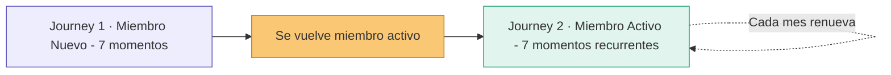
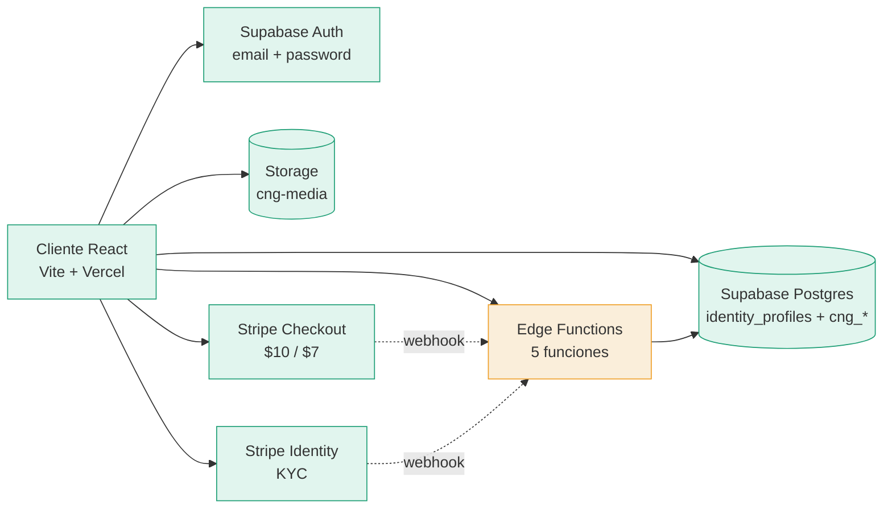
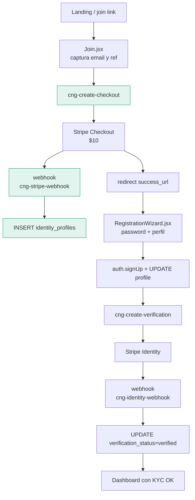
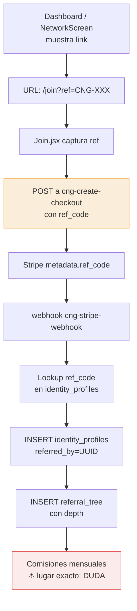
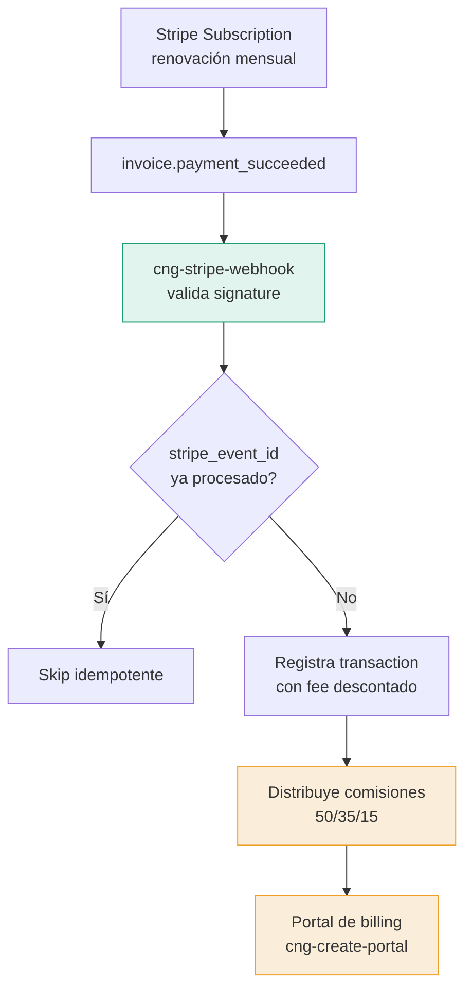
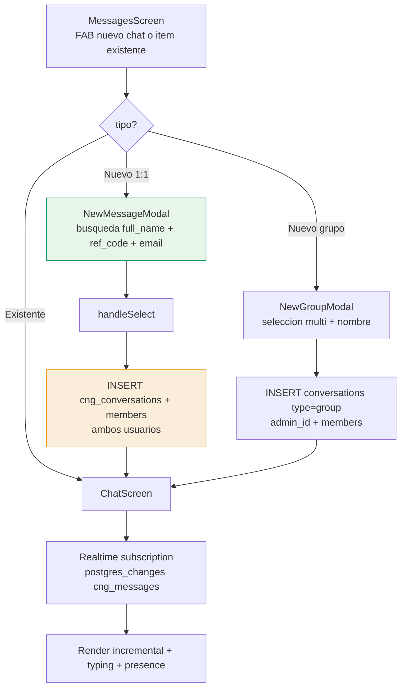
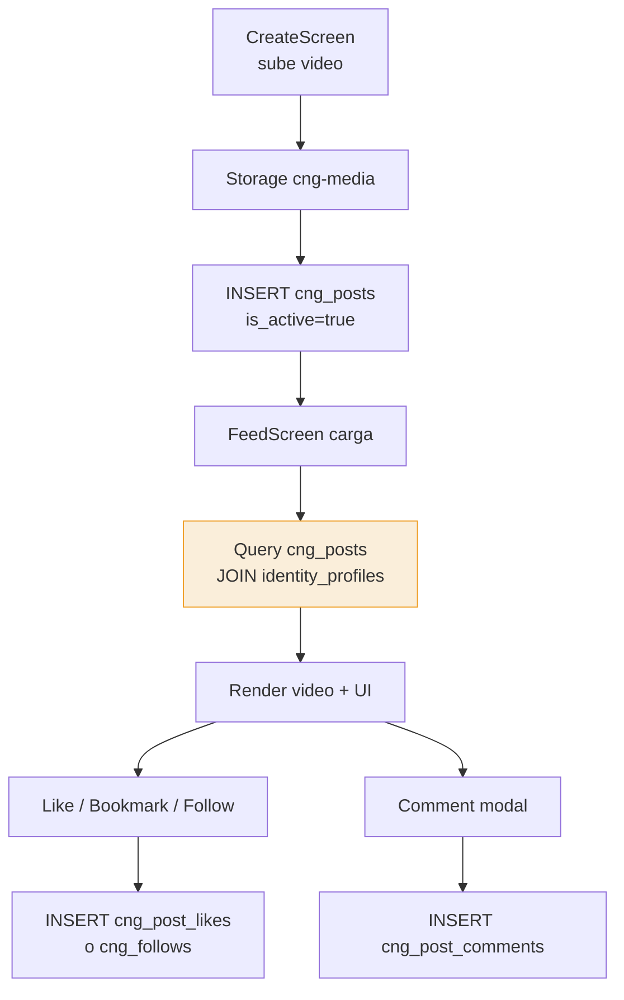
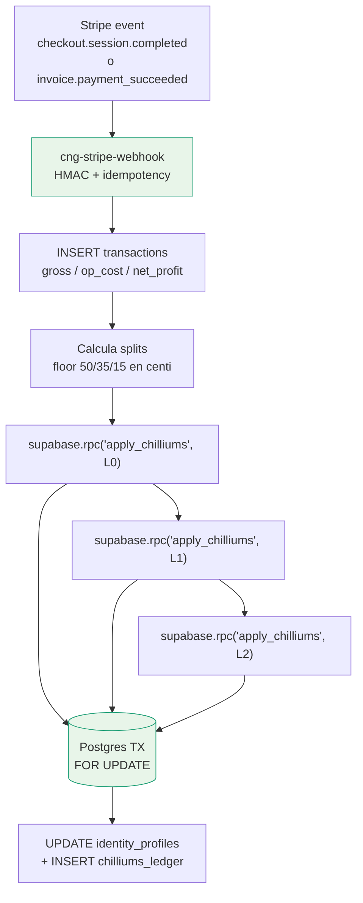

# CNG+ System Architecture

**Versión:** 1.1  
**Fecha:** 19 de abril de 2026  
**Autor:** Oscar Jovani (único desarrollador)  
**Estado del documento:** Vivo — actualizar al tocar arquitectura

---

## 1. Overview

CNG+ es una red social verificada con membresía de pago. Los miembros pagan $10 el primer mes (que cubre verificación de identidad vía Stripe Identity) y luego $7/mes recurrente. La app incluye feed tipo TikTok, mensajería directa, stories, y un programa de referidos de 2 niveles. La economía interna corre sobre **Chilliums** (programa de lealtad, no dinero). El sistema está construido sobre Supabase + Stripe, desplegado en Vercel.

👉 **Empieza por la Sección 3 (Journey Map) para entender el sistema en el idioma del usuario. Las demás secciones son referencia técnica de apoyo.**

---

## 2. Stack Técnico

| Capa | Tecnología | Versión |
|---|---|---|
| UI | React | 19.2.4 |
| Build | Vite | 8.0.1 |
| Routing | react-router-dom | 7.14.0 |
| Backend | Supabase (Postgres + Auth + Storage + Edge Functions) | project ref `jahnlhzbjcbmjnuzxsvj` |
| SDK cliente | @supabase/supabase-js | 2.101.1 |
| Pagos | Stripe Checkout (hosted) | — |
| KYC | Stripe Identity (flow `vf_1TI1VhClWFP3vllVQjUBTF7X`) | — |
| Hosting | Vercel | — |
| Storage bucket | `cng-media` | Supabase Storage |
| Emoji picker | emoji-mart + @emoji-mart/react + @emoji-mart/data | 5.6.0 / 1.1.1 / 1.2.1 |

> Nota: No hay SDK de Stripe en frontend — todo el flujo de pago es vía redirect a páginas hospedadas de Stripe.
>
> `@emoji-mart/react` solo declara peer `react ^16.8 || ^17 || ^18`, así que el repo usa `.npmrc` con `legacy-peer-deps=true` para que `npm install` local y en Vercel no rompa contra React 19.

---

## 3. Mapas del Usuario (Journey Maps) — VISTA PRINCIPAL

CNG App tiene dos tipos de usuarios que viven journeys distintos: el miembro nuevo durante su onboarding (Sección 3.1), y el miembro activo que ya usa la app dia con dia (Sección 3.2). Ambos mapas están conectados — el final del primero es el inicio del segundo.

### 3.1 Journey del Miembro Nuevo (Onboarding)

Este es el mapa más importante del sistema. Arriba se muestra qué vive el usuario en cada momento, y abajo qué pieza del código está trabajando. Los colores indican el estado de salud de cada componente técnico. Si un usuario reporta un problema, localiza el momento en el mapa y verás inmediatamente qué revisar.

```mermaid
flowchart TD
    subgraph M1["Momento 1 · Descubrimiento"]
        U1["Vanessa le comparte link por WhatsApp"]
        S1["Sistema: solo un link, nada mas"]
    end

    subgraph M2["Momento 2 · Interes"]
        U2["Abre el link y ve que Vanessa lo invita"]
        S2["Join.jsx captura ref_code del URL"]
    end

    subgraph M3["Momento 3 · Registro"]
        U3["Llena sus datos y paga 10 USD"]
        S3["Supabase Auth + Stripe Checkout + cng-stripe-webhook"]
    end

    subgraph M4["Momento 4 · Verificacion"]
        U4["Sube INE y selfie"]
        S4["Stripe Identity + cng-identity-webhook"]
    end

    subgraph M5["Momento 5 · Primer uso"]
        U5["Entra al feed tipo TikTok"]
        S5["FeedScreen + cng_posts + cng_follows"]
    end

    subgraph M6["Momento 6 · Interaccion social"]
        U6["Le escribe mensaje a alguien"]
        S6["MessagesScreen · BUG falta policy INSERT"]
    end

    subgraph M7["Momento 7 · Recompensa"]
        U7["Invita amigo y gana Chilliums"]
        S7["referral_tree + chilliums_ledger"]
    end

    U1 --> S1 --> U2
    U2 --> S2 --> U3
    U3 --> S3 --> U4
    U4 --> S4 --> U5
    U5 --> S5 --> U6
    U6 --> S6 --> U7
    U7 --> S7

    style U1 fill:#EEEDFE,stroke:#534AB7
    style U2 fill:#EEEDFE,stroke:#534AB7
    style U3 fill:#EEEDFE,stroke:#534AB7
    style U4 fill:#EEEDFE,stroke:#534AB7
    style U5 fill:#E1F5EE,stroke:#1D9E75
    style U6 fill:#E1F5EE,stroke:#1D9E75
    style U7 fill:#E1F5EE,stroke:#1D9E75
    style S1 fill:#F1EFE8,stroke:#888780
    style S2 fill:#F1EFE8,stroke:#888780
    style S3 fill:#E1F5EE,stroke:#1D9E75
    style S4 fill:#E1F5EE,stroke:#1D9E75
    style S5 fill:#F1EFE8,stroke:#888780
    style S6 fill:#FCEBEB,stroke:#E24B4A
    style S7 fill:#F1EFE8,stroke:#888780
```



### Leyenda de colores

- 🟣 Morado: usuario en onboarding (aún no es miembro activo)
- 🟢 Verde: usuario activo usando la app
- ⚪ Gris: sistema funcionando normal
- 🟢 Verde en sistema: recién auditado y confirmado OK
- 🟡 Amarillo: riesgo conocido pendiente de arreglar
- 🔴 Rojo: bug confirmado que afecta al usuario

### Momentos que necesitan atención

| Momento | Qué vive el usuario | Bug técnico | Referencia |
|---------|---------------------|-------------|------------|
| Momento 1-3 | ✅ **RESUELTO 19 abr 2026** | `ref_code` ahora persiste en localStorage (TTL 30 días) — commit `3ebc92e` | — |
| Momento 3 | ✅ **RESUELTO 19 abr 2026** | Webhook usa upsert con onConflict + ya no inventa datos con `email.split` — commits `3ebc92e`, `34984d2` | — |
| Momento 3 | ✅ **RESUELTO 19 abr 2026** | Wizard crea `identity_profile` nuevo antes del pago — commit `3ebc92e` | — |
| Momento 4 | Usuario ve momentáneamente "verifica tu identidad" otra vez tras completar KYC | ⚠️ Race condition visual: webhook puede tardar <5s en procesar; UI muestra `kyc_pending` hasta recarga | Cosmético — sin impacto funcional |
| Momento 4 | Comportamiento post-KYC asimétrico entre Join.jsx y Dashboard | ⚠️ Optimistic update asimétrico: Join setea `identity_verification_status='processing'`, Dashboard solo recarga | Cosmético |
| Momento 6 | No encuentra a un usuario que sabe que existe | Búsqueda solo filtra por `full_name` (no email, username, first_name) | Ver Sección 5.4 |
| Momento 6 | Usuarios con `full_name` NULL no aparecen en resultados | Caso Mónica — registros incompletos | Ver Sección 5.4 |
| Momento 6 | No puede enviar mensaje nuevo a alguien sin conversación previa | Falta policy INSERT en `cng_conversation_members` → RLS deny silencioso | Ver Sección 5.4 |
| Momento 6 | El clic "no hace nada" cuando la creación falla | `handleSelect` hace `console.error` sin toast al usuario | Ver Sección 5.4 |
| Momento 7 | Race condition potencial al transferir Chilliums | Transferencia hace UPDATE directo en cliente, no atómica | Ver Sección 5.6 |

<!-- DUDA: el bug "botón Ir a mi cuenta no navega" no está localizado con certeza aún. Podría afectar Momento 3 (después de pagar) o Momento 5 (primer uso). -->

### 3.2 Journey del Miembro Activo (Uso diario)

Una vez que el miembro pasó el onboarding, su relación con la app se vuelve diaria. Este mapa cubre los 7 momentos clave de uso recurrente, incluyendo la renovación mensual de membresía.

```mermaid
flowchart TD
    subgraph M8["Momento 8 · Regreso a la app"]
        U8["Abre la app y hace login"]
        S8["Supabase Auth + carga de identity_profile"]
    end
    subgraph M9["Momento 9 · Consumo de contenido"]
        U9["Scrollea feed y ve videos"]
        S9["FeedScreen + cng_posts + cng_likes"]
    end
    subgraph M10["Momento 10 · Creación de contenido"]
        U10["Sube una foto o video propio"]
        S10["CreatePostScreen + Supabase Storage + cng_posts"]
    end
    subgraph M11["Momento 11 · Mantiene relaciones"]
        U11["Chatea con amigos y sigue gente nueva"]
        S11["MessagesScreen + cng_conversations + cng_follows"]
    end
    subgraph M12["Momento 12 · Gasta Chilliums"]
        U12["Canjea Chilliums por beneficios"]
        S12["WalletScreen + chilliums_ledger + transactions"]
    end
    subgraph M13["Momento 13 · Acumula comisiones"]
        U13["Ve su red crecer y gana dinero"]
        S13["NetworkScreen + referral_tree + chilliums_ledger"]
    end
    subgraph M14["Momento 14 · Renovación mensual"]
        U14["Se le cobran 7 USD automáticamente"]
        S14["Stripe Subscriptions + cng-stripe-webhook"]
    end
    U8 --> S8 --> U9
    U9 --> S9 --> U10
    U10 --> S10 --> U11
    U11 --> S11 --> U12
    U12 --> S12 --> U13
    U13 --> S13 --> U14
    U14 --> S14
    style U8 fill:#E1F5EE,stroke:#1D9E75
    style U9 fill:#E1F5EE,stroke:#1D9E75
    style U10 fill:#E1F5EE,stroke:#1D9E75
    style U11 fill:#E1F5EE,stroke:#1D9E75
    style U12 fill:#E1F5EE,stroke:#1D9E75
    style U13 fill:#E1F5EE,stroke:#1D9E75
    style U14 fill:#E1F5EE,stroke:#1D9E75
    style S8 fill:#F1EFE8,stroke:#888780
    style S9 fill:#F1EFE8,stroke:#888780
    style S10 fill:#F1EFE8,stroke:#888780
    style S11 fill:#FCEBEB,stroke:#E24B4A
    style S12 fill:#F1EFE8,stroke:#888780
    style S13 fill:#F1EFE8,stroke:#888780
    style S14 fill:#E1F5EE,stroke:#1D9E75
```



<!-- DUDA: el diagrama menciona "CreatePostScreen" y "WalletScreen" — en el código git actual solo existe CreateScreen.jsx (no "Post" en el nombre); WalletScreen NO existe como archivo — la UI para gastar/canjear Chilliums no está implementada todavía. La funcionalidad de transferir Chilliums está embebida dentro de ChatScreen.jsx. Los labels del diagrama se preservan como los diste porque reflejan la intención de producto, pero la tabla siguiente marca las brechas reales contra el código. -->

### Momentos que necesitan atención

| Momento | Qué vive el usuario | Bug o riesgo | Referencia |
|---------|---------------------|--------------|------------|
| Momento 9 | Ve el feed pero los perfiles que aparecen no coinciden con los que encuentra en búsqueda | Feed filtra por `cng_posts.is_active=true` y hace JOIN con `identity_profiles`; búsqueda lee `identity_profiles` directo — mismatch entre ambos caminos | Ver Sección 5.5 |
| Momento 10 | Sube un post y el archivo se guarda pero el post no aparece | Upload a `cng-media` y INSERT a `cng_posts` no son transaccionales — si falla el INSERT queda archivo huérfano en bucket | [CreateScreen.jsx:128-145](src/pages/app/CreateScreen.jsx:128) |
| Momento 10 | Sube video muy largo y pasa la validación | Límite de 3 min validado solo en cliente; sin enforcement server-side ni constraint en DB | [CreateScreen.jsx:103](src/pages/app/CreateScreen.jsx:103) |
| Momento 11 | No puede iniciar chat nuevo ni encontrar gente por su email | Hereda TODOS los bugs del Momento 6: falta policy INSERT en `cng_conversation_members`, búsqueda solo por `full_name`, `handleSelect` sin toast de error | Ver Sección 5.4 |
| Momento 12 | No tiene dónde canjear Chilliums | ❌ No existe `WalletScreen` en el código — feature no implementada | <!-- pendiente de diseño/implementación --> |
| Momento 12 | Transfiere Chilliums a un amigo por chat y se producen dobles débitos | Transferencia hace UPDATE directo en cliente — no atómica, expuesta a race condition | Ver Sección 5.6 |
| Momento 13 | Ve su red pero no le llegan las comisiones mensuales de $3.50 / $2.00 | Lógica de comisiones recurrentes no está en código git — posiblemente en pg_cron o fuera del repo | Ver Sección 5.2 (DUDA pendiente) |
| Momento 14 | Le cobran el mes y su membresía se renueva | ✅ Idempotencia PRESENTE: webhook chequea `stripe_event_id` en `transactions.metadata` antes de procesar | [cng-stripe-webhook/index.ts:359-400](supabase/functions/cng-stripe-webhook/index.ts:359) |
| Momento 14 | Stripe reenvía el mismo evento en ventana apretada | ⚠️ Riesgo residual: la idempotencia chequea con `.eq().maybeSingle()` antes del `.insert()` — sin lock transaccional, dos invocaciones concurrentes podrían ambas pasar el check | [cng-stripe-webhook/index.ts:364-400](supabase/functions/cng-stripe-webhook/index.ts:364) |

### Conexión entre journeys



---

## 4. Mapa Técnico del Sistema (Vista de Pájaro)

> Esta sección es complementaria al Journey Map. Úsala cuando necesites entender la topología técnica de las piezas.



⚠️ **Edge Functions amarillo** porque 2 de las 5 funciones invocadas (`cng-create-checkout`, `cng-create-portal`) **no están versionadas en git** — viven solo en Supabase.

---

## 5. Flujos Críticos

### 5.1 Registro de miembro nuevo

**Descripción:** El usuario llega a `/join`, ingresa email, es redirigido a Stripe Checkout ($10), vuelve, completa el wizard de registro, pasa por Stripe Identity (KYC), y queda activo. Todo sin intervención humana.



**Componentes:**
- [src/pages/Join.jsx](src/pages/Join.jsx) (landing + captura ref)
- [src/components/RegistrationWizard.jsx](src/components/RegistrationWizard.jsx) (post-pago)
- [src/context/AuthContext.jsx](src/context/AuthContext.jsx) (signUp)
- [supabase/functions/cng-stripe-webhook/index.ts](supabase/functions/cng-stripe-webhook/index.ts) (crea fila)
- [supabase/functions/cng-create-verification/index.ts](supabase/functions/cng-create-verification/index.ts) (dispara KYC)
- [supabase/functions/cng-identity-webhook/index.ts](supabase/functions/cng-identity-webhook/index.ts) (marca verificado)
- ⚠️ `cng-create-checkout` — invocada desde [Join.jsx:231](src/pages/Join.jsx:231) pero **no existe en git**

**Tablas:** `identity_profiles`, `referral_tree` (si hay ref), `auth.users` (vía Supabase Auth)

**Edge Functions:** las 5 listadas arriba

**Riesgos (actualizados 19 abr 2026):**
- ✅ RESUELTO — Webhook ahora usa upsert con `onConflict: 'email'` + ya no inventa datos con `email.split` (commit `3ebc92e`)
- ✅ RESUELTO — `ref_code` persiste en localStorage con TTL 30 días (commit `3ebc92e`)
- ✅ RESUELTO — Dual role (Matrix agent) desbloqueado: wizard crea `identity_profile` nuevo antes del pago (commit `3ebc92e`)
- ⚠️ Race condition visual post-KYC (<5s de latencia del webhook) — cosmético, sin impacto funcional

**Commits del 19 abr 2026 que impactan este flujo:**
`3ebc92e` wizard antes del pago · `072ce93` import cng-create-checkout · `34984d2` validaciones server-side checkout · `34404d3` HMAC KYC + session reuse · `968f27a` gate `isFullyActive` + dashboard states · `a0dd7c3` filtros ledger actualizados

---

### 5.2 Sistema de referidos (2 niveles)

**Descripción:** Cada miembro tiene un `ref_code` corto (`CNG-XXXXXX`). Al registrar a alguien con ese code, el referido queda vinculado en `referral_tree` con su depth. Comisiones: nivel 1 = $3.50/mes + 35%; nivel 2 = $2.00/mes + 15%.



**Componentes:**
- [src/pages/Dashboard.jsx:12-13](src/pages/Dashboard.jsx:12) — construye link `/join?ref=CNG-XXX`
- [src/pages/app/NetworkScreen.jsx:17-18](src/pages/app/NetworkScreen.jsx:17) — mismo link en app
- [src/pages/Join.jsx:122-124](src/pages/Join.jsx:122) — captura `?ref=`
- [supabase/functions/cng-stripe-webhook/index.ts:226-233](supabase/functions/cng-stripe-webhook/index.ts:226) — resuelve code → UUID
- [supabase/functions/cng-stripe-webhook/index.ts:284](supabase/functions/cng-stripe-webhook/index.ts:284) — inserta en `referral_tree`

**Tablas:** `identity_profiles.ref_code`, `identity_profiles.referred_by`, `identity_profiles.referral_depth`, `referral_tree`, `chilliums_ledger` (comisiones)

**Edge Functions:** `cng-stripe-webhook`, `cng-create-checkout` (⚠️ no-git)

<!-- DUDA: ¿dónde se calculan y pagan las comisiones mensuales recurrentes de $3.50 / $2.00? No vi una edge function que corra mensualmente. Podría vivir en un cron de Supabase (pg_cron) o en lógica del webhook de renovación. Necesita auditoría adicional. -->

**Riesgos (actualizados 19 abr 2026):**
- ✅ RESUELTO — `ref_code` ahora persiste en localStorage con TTL 30 días + fallback si URL vacía (commit `3ebc92e`)
- ✅ RESUELTO — Self-referral ahora prevenido: Join.jsx bloquea si email del usuario == email del referrer (commit `3ebc92e`)
- ✅ RESUELTO — Email duplicate también bloqueado antes de avanzar al wizard (commit `3ebc92e`)
- ⚠️ Lógica de comisiones recurrentes **no localizada en código git** — puede estar en pg_cron o fuera del repo (sin cambio)

---

### 5.3 Suscripción recurrente

**Descripción:** Tras el primer mes de $10, Stripe facturará $7/mes automáticamente. El webhook recibe eventos `invoice.payment_succeeded` para mantener el estado activo, y `customer.subscription.deleted` para cancelaciones.



**Componentes:**
- [src/pages/Dashboard.jsx:18](src/pages/Dashboard.jsx:18) — invoca portal (`cng-create-portal`)
- [src/pages/app/ProfileScreen.jsx:47](src/pages/app/ProfileScreen.jsx:47) — mismo portal
- [supabase/functions/cng-stripe-webhook/index.ts](supabase/functions/cng-stripe-webhook/index.ts) — maneja eventos

**Tablas:** `transactions` (recién agregada para idempotencia), `chilliums_ledger`, `identity_profiles`

**Edge Functions:** `cng-stripe-webhook`, `cng-create-portal` (⚠️ no-git)

**Fixes recientes (git log):**
- ✅ `e44fc0a` — idempotency via `stripe_event_id` en `transactions.metadata`
- ✅ `0a06a1d` — descuenta Stripe fee del monto distribuible
- ✅ `8011d5c` — usa `source_user_id` en `chilliums_ledger`

**Riesgos conocidos:**
- ⚠️ Reparto 50/35/15 — confirmar cobertura con la [auditoria-chilliums-2026-04-16/](auditoria-chilliums-2026-04-16/)
- ⚠️ `cng-create-portal` no versionada en git

---

### 5.4 Mensajería social

**Descripción:** Mensajería 1:1 y grupos con paridad funcional aproximada a WhatsApp. Usuario busca miembros, abre chat nuevo o existente, y envía mensajes vía `cng_messages`. ChatScreen (~4200 líneas) concentra la mayor parte de la UX.

**Features vigentes (19 abr 2026):**
- **Composición:** texto, imagen, video, voz (grabadora), documento, ubicación, polls, stickers, GIFs (GIPHY), ver-una-vez.
- **Mensajes:** reply, forward, star, edit (ventana 15 min), delete "para mí" vs "para todos", copy.
- **Reacciones:** 6 shortcuts rápidos + picker custom (emoji-mart) con cualquier emoji Unicode.
- **Formato inline:** markdown-lite al renderizar — `*bold*`, `_italic_`, `~strike~`, `` `mono` ``. Se guarda texto crudo; el parse es solo en UI.
- **@Menciones:** autocomplete en grupos desde `membersMap`, navegación con flechas, highlight al render.
- **Presence:** indicador "En línea" / "Última vez hace N min" via hook `usePresence` (heartbeat 30s + visibilitychange + beacon on unload). Scope: solo se marca online en `MessagesScreen` y `ChatScreen`, no en toda la app.
- **Compresión:** imágenes se pasan a JPEG 1920×1920 q=0.85 (avatar grupo: 512×512 q=0.9) antes del upload. GIFs y videos no se tocan. Si el comprimido pesa más que el original, se sube el original.
- **Failed send:** etiqueta "No enviado · Toca para reintentar" con `handleRetryMessage`.
- **Validación upload:** 16MB imagen/video/voz, 100MB documento, 5MB avatar grupo.
- **Cleanup atómico:** si el INSERT/UPDATE falla tras un upload exitoso, el objeto en `cng-media` se remueve como best-effort para evitar huérfanos.
- **Grupos:** crear, cambiar avatar/descripción (solo admin), agregar miembros (solo admin, con búsqueda), remover miembros (solo admin), salir del grupo (no admin). Admin no puede salir — feature pendiente.
- **Gestión de chat:** vaciar chat (`cleared_at` por miembro) y eliminar chat (`DELETE FROM cng_conversation_members`), igual a WhatsApp.
- **Búsqueda in-chat:** filtra mensajes de texto del historial, excluye soft-deleted y `deletedForMeSet`.
- **Starred modal:** lista mensajes marcados, excluye los eliminados "para mí".
- **Anclado visual:** cuando hay pocos mensajes, se apilan al fondo (inner wrapper `marginTop: 'auto'`).



**Componentes:**
- [src/pages/app/MessagesScreen.jsx](src/pages/app/MessagesScreen.jsx) — lista de chats, NewMessageModal, NewGroupModal, context menu (silenciar, fijar, archivar, vaciar, eliminar), realtime preview, `usePresence()` montado acá.
- [src/pages/app/ChatScreen.jsx](src/pages/app/ChatScreen.jsx) (~4200 líneas) — todo lo demás, `usePresence()` también montado acá.
- [src/hooks/usePresence.js](src/hooks/usePresence.js) — upsert en `user_presence` (30s heartbeat + visibilitychange + `sendBeacon` on unload).
- [src/pages/app/StoriesComponents.jsx:24-77](src/pages/app/StoriesComponents.jsx:24) — reply a story crea conversación también.

**Tablas:** `cng_conversations`, `cng_conversation_members` (con `cleared_at`, `is_muted`, `is_pinned`, `is_archived`), `cng_messages` (con `delivery_status`, `edited_at`, `is_deleted`, `is_view_once`, `viewed_once_at`, `reply_to_id`), `cng_message_reactions`, `cng_starred_messages`, `cng_deleted_messages` (delete-for-me), `cng_blocked_users`, `cng_reports`, `cng_polls`, `cng_poll_votes`, `user_presence`.

**RLS (de [src/sql/social-tables.sql](src/sql/social-tables.sql)):**
- `cng_conversations` INSERT: `created_by = auth.uid()` ✅
- `cng_messages` INSERT: `sender_id = auth.uid()` + membership check ✅
- `user_presence` SELECT: todos; UPDATE/UPSERT: solo fila propia ✅

**Bugs y gaps conocidos:**
- ⚠️ `cng_conversation_members` INSERT policy — la arquitectura doc vieja marcaba "policy ausente" como crítico; los flujos de `handleAddMembers` / `handleLeaveGroup` escriben a esa tabla sin error en test interno, así que hoy o la policy existe o las operaciones funcionan por SECURITY DEFINER. **Acción pendiente:** auditar policies reales en dashboard y dejar SQL versionado.
- ⚠️ Presence "zombie online" parcial — `sendBeacon` al REST de Supabase no autentica (PostgREST lo rechaza); se depende de la tolerancia 90s client-side en ChatScreen. Acción pendiente: derivar `is_online` en DB (columna generada o vista) para matar el problema por diseño.
- ⚠️ `isMessageEditable` — 15 min window correcto, pero dependía de float timestamp; ya rechaza IDs `temp-*` y estados `sending/failed`.
- ⚠️ Edit en modo edición no resetea `mentionQuery` stale — edge case, dropdown puede quedar visible al entrar a edit. Documentado, no fix aún.
- 📄 22 commits de chat hoy (lista en "Última modificación"); 6 issues pre-existentes de lint siguen, no introducidos por esta sesión.

---

### 5.5 Feed social

**Descripción:** Usuarios crean posts (video + caption), aparecen en feed vertical tipo TikTok con likes, bookmarks, comments, follows.



**Componentes:**
- [src/pages/app/CreateScreen.jsx:129-145](src/pages/app/CreateScreen.jsx:129) — crea post (upload + INSERT)
- [src/pages/app/FeedScreen.jsx:436-569](src/pages/app/FeedScreen.jsx:436) — feed infinito con likes/bookmarks/follows
- [src/pages/app/ExploreScreen.jsx:89](src/pages/app/ExploreScreen.jsx:89) — grid explorer de posts
- [src/pages/app/ProfileScreen.jsx:26-29](src/pages/app/ProfileScreen.jsx:26) — posts del usuario en su perfil

**Tablas:** `cng_posts`, `cng_post_likes`, `cng_post_comments`, `cng_post_bookmarks`, `cng_follows`, `identity_profiles` (autor JOIN)

**Storage:** bucket `cng-media` (videos + imágenes)

**Riesgos conocidos:**
- ⚠️ Feed filtra por `cng_posts.is_active=true` pero la búsqueda de usuarios no cruza este filtro → usuarios aparecen en feed pero no en búsqueda (inconsistencia reportada)
- <!-- DUDA: ¿hay algoritmo de ranking del feed o solo orden cronológico? No visto en código. -->

---

### 5.6 Chilliums (economía interna)

**Descripción:** Chilliums son un programa de lealtad (NO dinero). Valor interno 1 Chillium = 1 USD para contabilidad, pero jamás se presenta como moneda al usuario. Se ganan por referidos y suscripciones (reparto 50/35/15). **No existen transferencias P2P ni redención hoy** — eso vive en un futuro módulo Wallet aún no construido.

**Estado banking-grade (19 abr 2026, commits `4ae71c8` + `0481736`):**

El subsistema Chilliums pasó de "UPDATE cliente float" a un diseño con garantías de DB financiera. Cuatro decisiones estructurales viven consolidadas en la ADR-11:

1. **Enteros en DB** — toda la persistencia usa `bigint` en centi-chilliums. 1 CHL = 100 centi-chilliums. Columnas: `identity_profiles.chilliums_balance`, `chilliums_total_earned`, `chilliums_total_spent`; `chilliums_ledger.amount`, `balance_after`. Cero operaciones flotantes en el backend.
2. **RPC única** — `apply_chilliums(user_id, delta, type, description, source_user_id, referral_level, source_transaction_id)` es la **única puerta** al balance. Toma lock pesimista `FOR UPDATE` sobre `identity_profiles`, inserta en `chilliums_ledger`, actualiza `chilliums_balance` y `chilliums_total_earned/_spent` en la misma transacción. Marcada `SECURITY DEFINER`; grant exclusivo a `service_role`. El cliente no puede tocar balances directamente.
3. **FKs a `identity_profiles(id)` con `ON DELETE RESTRICT`** — `chilliums_ledger.user_id` y `.source_user_id` ya no apuntan a `auth.users`. El ledger es historial indestructible: no se puede borrar un perfil si tiene entradas. Si se requiere eliminación legal de cuenta, se hace soft-delete del perfil preservando el ledger.
4. **Floor estricto en el split 50/35/15** — cada nivel recibe `floor(base * split_i)` en centi-chilliums. El residuo (1–2 centi-chilliums dependiendo del base) queda como margen de empresa. No se reparte a nadie. Así `L0 + L1 + L2 ≤ base`, nunca mayor, y el invariante financiero siempre se conserva.



**Tipos del ledger (19 abr 2026):**
- `cashback_direct` — miembro pagador (L0, 50%)
- `cashback_network` — referrer directo (L1, 35%) y abuelo (L2, 15%), distinguidos por la columna `referral_level` (1 o 2)
- Tipos anteriores (`earn_referral_level_0/1/2`) reemplazados por este set consolidado

**Componentes:**
- [supabase/functions/cng-stripe-webhook/index.ts](supabase/functions/cng-stripe-webhook/index.ts) — webhook reescrito: llama `supabase.rpc('apply_chilliums', ...)` en vez de UPDATE manual. No toca `chilliums_balance` directamente.
- RPC `apply_chilliums` — definida en DB (no versionada en git todavía; ver gap en Sección 9).
- [src/lib/chilliums.js](src/lib/chilliums.js) — helper de frontend:
  - `formatChilliums(centi)` — display canónico, divide por 100, `en-US`, 2 decimales fijos, separador de miles. Acepta null/undefined/NaN devolviendo `'0.00'`.
  - `toCentiChilliums(chilliums)` — inverso para inputs legacy: `Math.floor(num * 100)`.
  - `fromCentiChilliums(centi)` — conversión numérica para cálculo (no display).
- Display migrado (21 reemplazos de `.toFixed(2)` / `.toFixed(0)` → `formatChilliums`):
  - [src/pages/Dashboard.jsx](src/pages/Dashboard.jsx) — balance + ganado total (también se corrigió bug de campo fantasma `total_earnings` → `chilliums_total_earned`).
  - [src/pages/app/ProfileScreen.jsx](src/pages/app/ProfileScreen.jsx) — stats row + balance card.
  - [src/pages/Network.jsx](src/pages/Network.jsx) y [src/pages/app/NetworkScreen.jsx](src/pages/app/NetworkScreen.jsx) — balance, earnings {cashback, referral_l1, referral_l2, bonus}, total_earned, total_spent, ledger rows.

**Chat no tiene nada de Chilliums.** El modal de transferencia P2P, los handlers `openChilliumsModal` / `handleSendChilliums`, el render de `message_type === 'chilliums'` y la rama preview residual en MessagesScreen fueron eliminados en `261d9f8` y `0481736`. La funcionalidad volverá como parte del **módulo Wallet** futuro, no desde el chat.

**Tablas:** `identity_profiles.chilliums_balance`, `.chilliums_total_earned`, `.chilliums_total_spent`, `chilliums_ledger`, `transactions`.

**Deuda conocida (post-migración):**
- ⚠️ RPC `apply_chilliums` no vive en `supabase/migrations/` todavía; solo en dashboard.
- ⚠️ Valores legacy con tipos viejos del ledger no se backfillearon automáticamente — requiere `UPDATE` manual si hubo data producción antes del 19 abr.
- ⚠️ `identity_profiles.total_earnings` (campo fantasma) puede seguir existiendo en el schema aunque ya no se lee desde código. Candidato a `DROP COLUMN`.
- 📄 Ver [auditoria-chilliums-2026-04-16/](auditoria-chilliums-2026-04-16/) para auditoría previa (pre-migración).

---

## 6. Tablas de Base de Datos

> Lista derivada de `.from()` en código. El schema real vive en Supabase dashboard; este repo no tiene `supabase/migrations/`.

### Core / Identity
| Tabla | Propósito |
|---|---|
| `identity_profiles` | Perfil principal del miembro CNG+ (FK a `auth.users.id`) |
| `cng_members_compat` | Vista de compatibilidad (migración desde `cng_members`) |
| `referral_tree` | Árbol de referidos con depth (nivel 1, 2) |
| `chilliums_ledger` | Libro mayor de transacciones de Chilliums |
| `transactions` | Transacciones Stripe con `stripe_event_id` para idempotencia |

### Feed / Social
| Tabla | Propósito |
|---|---|
| `cng_posts` | Videos/imágenes del feed |
| `cng_post_likes` | Likes a posts |
| `cng_post_comments` | Comentarios en posts |
| `cng_post_bookmarks` | Posts guardados |
| `cng_follows` | Relación follower → following |

### Mensajería
| Tabla | Propósito |
|---|---|
| `cng_conversations` | Hilo de conversación (directo o grupo, con `admin_id` para grupos) |
| `cng_conversation_members` | Miembros en cada conversación (`cleared_at`, `is_muted`, `is_pinned`, `is_archived`) |
| `cng_messages` | Mensajes individuales (`delivery_status`, `edited_at`, `is_deleted`, `is_view_once`, `viewed_once_at`, `reply_to_id`) |
| `cng_message_reactions` | Reacciones a mensajes (emoji, ahora soporta cualquier Unicode vía emoji-mart) |
| `cng_starred_messages` | Mensajes marcados |
| `cng_deleted_messages` | "Eliminar para mí" — par (user_id, message_id); no borra el mensaje, solo oculta para ese usuario |
| `cng_blocked_users` | Bloqueos entre usuarios |
| `cng_reports` | Reportes de moderación |
| `user_presence` | `(user_id, last_seen_at, is_online, updated_at)` — heartbeat de `usePresence`. RLS: lectura pública, escritura solo a fila propia |

### Stories / Polls
| Tabla | Propósito |
|---|---|
| `cng_stories` | Stories efímeras (24h) |
| `cng_story_views` | Vistas por story |
| `cng_story_reactions` | Reacciones a stories |
| `cng_story_replies` | Respuestas privadas a stories |
| `cng_polls` | Encuestas dentro de chat |
| `cng_poll_votes` | Votos a encuestas |

### Storage
| Bucket | Propósito |
|---|---|
| `cng-media` | Videos, imágenes, avatares |

<!-- DUDA: existe tabla `cng_notifications` referenciada en src/sql/social-tables.sql:436 pero no se usa desde el frontend. ¿Es un stub futuro? -->

---

## 7. Edge Functions

| Función | Estado | Propósito |
|---|---|---|
| `cng-create-checkout` | ✅ En git (19 abr 2026) | Crea Stripe Checkout Session para $10 inicial + valida que exista profile con `payment_status=pending` antes de Stripe |
| `cng-create-portal` | ❌ No en git | Crea Stripe Billing Portal session para gestionar suscripción |
| `cng-create-verification` | ✅ En git | Crea Stripe Identity VerificationSession |
| `cng-stripe-webhook` | ✅ En git | Procesa eventos de Stripe Checkout + Subscription |
| `cng-identity-webhook` | ✅ En git | Procesa eventos de Stripe Identity (KYC verificado) |

**Configuración crítica:** `supabase/config.toml` desactiva `verify_jwt` para `cng-stripe-webhook` (Stripe no envía Authorization header).

---

## 8. Rutas del Frontend

Desde [src/App.jsx](src/App.jsx):

| Ruta | Componente | Notas |
|---|---|---|
| `/` | `Landing` | Pública |
| `/login` | `Login` | Pública |
| `/join` | `Join` | Pública (captura `?ref=`) |
| `/dashboard` | redirect → `/app/feed` | Protegida |
| `/app` | `AppShell` (con outlets `null`) | Protegida — AppShell renderiza screens por pathname |
| `/app/feed` | FeedScreen (vía AppShell) | — |
| `/app/explore` | ExploreScreen | — |
| `/app/create` | CreateScreen | — |
| `/app/messages` | MessagesScreen | — |
| `/app/profile` | ProfileScreen | — |
| `/app/network` | NetworkScreen | — |
| `/app/chat/:conversationId` | ChatScreen | — |
| `/app/travel`, `/app/candystakes`, `/app/realestate`, `/app/nutrition`, `/app/store-local`, `/app/store` | Placeholders / features en desarrollo | — |
| `/network` | `Network` (legacy, fuera de `/app`) | Protegida — ⚠️ posible duplicado con `/app/network` |

<!-- DUDA: ¿por qué existe /network y /app/network? Uno es legacy — debería consolidarse. -->

---

## 9. Bugs Conocidos y Deuda Técnica

| # | Bug | Severidad | Ubicación | Estado |
|---|---|---|---|---|
| 1 | Búsqueda solo usa `full_name` (no email, username, first_name) | ❌ Crítico UX | [MessagesScreen.jsx:40-45](src/pages/app/MessagesScreen.jsx:40) | Pendiente |
| 2 | Registros con `full_name` NULL no aparecen en búsqueda (caso Mónica) | ⚠️ Bloqueante puntual | Schema issue | Pendiente |
| 3 | Falta policy INSERT en `cng_conversation_members` → enviar mensaje nuevo falla | ❌ Bug crítico | [social-tables.sql:395-407](src/sql/social-tables.sql:395) | Pendiente |
| 4 | `handleSelect` hace `console.error` sin toast al usuario | ⚠️ UX silenciosa | [MessagesScreen.jsx:106-107](src/pages/app/MessagesScreen.jsx:106) | Pendiente |
| 5 | Webhook `cng-stripe-webhook` usa `.insert()` sin upsert → crash en retry | — | [cng-stripe-webhook/index.ts](supabase/functions/cng-stripe-webhook/index.ts) | ✅ **RESUELTO 19 abr 2026** — upsert con `onConflict: 'email'` + eliminado default `email.split("@")[0]` (commit `3ebc92e`) |
| 6 | Botón "Ir a mi cuenta" no navega en algunos casos | — | [Join.jsx:667](src/pages/Join.jsx:667) | ✅ **RESUELTO 19 abr 2026** — ahora `<Link to="/dashboard">` directo (commit `968f27a`) |
| 7 | `ref_code` solo persistido en URL (sin localStorage) → pérdidas de comisión | — | [Join.jsx](src/pages/Join.jsx) | ✅ **RESUELTO 19 abr 2026** — localStorage con TTL 30 días + leído como fallback si URL vacía (commit `3ebc92e`) |
| 8 | Dual role (agente Matrix que quiere ser miembro CNG+) no soportado | — | [RegistrationWizard.jsx](src/components/RegistrationWizard.jsx) | ✅ **RESUELTO 19 abr 2026** — wizard crea `identity_profile` nuevo antes del pago; bloqueo básico removido (commit `3ebc92e`) |
| 9 | Transferencia de Chilliums en cliente (UPDATE directo) → race condition | — | — | ✅ **REMOVIDO 19 abr 2026** — feature P2P eliminada del chat (commits `261d9f8`, `0481736`). La funcionalidad volverá en el módulo Wallet futuro sobre la RPC `apply_chilliums` (ver ADR-11) |
| 10 | 2 Edge Functions no versionadas en git | ⚠️ Riesgo operacional | — | ⚙️ **PARCIAL 19 abr 2026** — `cng-create-checkout` ya en git (commit `072ce93`); `cng-create-portal` sigue fuera |
| 11 | RLS de `identity_profiles` no está en git (vive solo en dashboard) | ⚠️ Riesgo operacional | — | Pendiente — traer a git |
| 12 | No hay `supabase/migrations/` → schema no versionado | ⚠️ Riesgo | — | Pendiente — `supabase db pull` |
| 13 | Wallet como módulo no existe — prerequisito para M12 del Journey Activo (gastar/transferir/redimir Chilliums) | ⚠️ Feature gap | — | Pendiente — diseño + construcción del módulo sobre RPC `apply_chilliums` |
| 14 | RPC `apply_chilliums` no versionada (vive solo en dashboard) | ⚠️ Riesgo operacional | — | Pendiente — traer a `supabase/migrations/` junto con el resto del schema |

---

## 10. Checklist de Salud del Sistema

| Componente | Estado | Última revisión | Notas |
|---|---|---|---|
| Stripe Identity (flow) | ✅ OK | 17 abr 2026 | SSN desactivado |
| Supabase email confirm | ✅ OK | 17 abr 2026 | Desactivado para signup automático |
| Webhook `cng-identity-webhook` (HMAC) | ✅ OK | 19 abr 2026 | HMAC ahora validado con `STRIPE_IDENTITY_WEBHOOK_SECRET` (commit `34404d3`). Antes no tenía validación — vulnerabilidad cerrada. |
| Webhook `cng-stripe-webhook` (JWT) | ✅ OK | 18 abr 2026 | `verify_jwt=false` vía config.toml |
| Webhook `cng-stripe-webhook` (idempotencia de eventos) | ✅ OK | ~17 abr 2026 | Commit e44fc0a |
| Webhook `cng-stripe-webhook` (idempotencia de perfil) | ✅ OK | 19 abr 2026 | Ya usa upsert con onConflict; no crashea en retry (commit `3ebc92e`) |
| Búsqueda de usuarios | ❌ Bug | 18 abr 2026 | Solo `full_name`, sin filtros consistentes |
| Flujo enviar mensaje nuevo | ❌ Bug | 18 abr 2026 | Falta policy INSERT en `conversation_members` |
| Feed social | ⚠️ Warning | 18 abr 2026 | Mismatch de filtros con búsqueda |
| Chilliums (transferencias P2P) | ✅ OK | 19 abr 2026 | **REMOVIDO** — feature eliminada del chat (`261d9f8`, `0481736`); volverá como parte del futuro módulo Wallet sobre la RPC `apply_chilliums` |
| Chilliums (reparto 50/35/15) | ✅ OK | 19 abr 2026 | Vía RPC atómica `apply_chilliums` (lock `FOR UPDATE`) + floor estricto — invariante `L0+L1+L2 ≤ base` garantizado. Commit `4ae71c8` |
| Chilliums (tipos del ledger) | ✅ OK | 19 abr 2026 | Consolidados a `cashback_direct` (L0) y `cashback_network` (L1/L2 con `referral_level` 1 o 2). Commit `4ae71c8` |
| Chilliums (enteros bigint) | ✅ OK | 19 abr 2026 | Persistencia en centi-chilliums (1 CHL = 100 centi). Cero float arithmetic en backend. Helper `src/lib/chilliums.js` en frontend. Commit `4ae71c8` |
| Chilliums (FKs del ledger) | ✅ OK | 19 abr 2026 | Apuntan a `identity_profiles(id)` con `ON DELETE RESTRICT` — historial indestructible. Commit `4ae71c8` |
| Referral link persistence | ✅ OK | 19 abr 2026 | localStorage con TTL 30 días + fallback si URL vacía (commit `3ebc92e`) |
| Dual-role user (agente + miembro) | ⚠️ Parcial | 19 abr 2026 | Wizard crea `identity_profile` nuevo antes del pago (resuelve bloqueo básico), pero el concepto "un humano con 2 roles" sigue sin diseñarse explícitamente en el schema |
| Schema versionado | ❌ Gap | 19 abr 2026 | No hay `supabase/migrations/` en repo |
| Edge Functions versionadas | ⚠️ Parcial | 19 abr 2026 | 4 de 5 en git; `cng-create-portal` sigue fuera (commit `072ce93` trajo `cng-create-checkout`) |
| RLS de `identity_profiles` versionada | ❌ Gap | 19 abr 2026 | Solo en dashboard |
| Emails transaccionales | ❓ Desconocido | — | <!-- DUDA: ¿qué emails existen? ¿bienvenida, confirmación de pago, KYC OK? --> |

---

## 11. Decisiones de Arquitectura Importantes (ADRs)

### ADR-01 — Uso de `identity_profiles` (no `cng_members`)
`cng_members` fue la tabla original. Se migró a `identity_profiles` para alinear el nombre con Stripe Identity y permitir un modelo de perfil más rico. `cng_members_compat` es una vista de compatibilidad que aún se consulta desde código legacy. **Estado:** migración en progreso; nueva lógica debe escribir en `identity_profiles` directamente.

### ADR-02 — Stripe Identity sin SSN
La opción de colectar SSN en Stripe Identity está desactivada. Motivo: reducir fricción en onboarding y limitar el alcance regulatorio del KYC. La verificación se queda en documento de identidad + selfie. **Estado:** confirmado, funcional al 17 abr 2026.

### ADR-03 — Email confirm desactivado en Supabase Auth
Supabase Auth permite configurar si un email debe confirmarse antes de autenticar. Está desactivado para que un usuario pueda completar el flujo completo (pago → wizard → KYC) sin clicks extra en su email. La verificación del humano se delega a Stripe Identity, que es más robusta que un click en link. **Estado:** confirmado, funcional.

### ADR-04 — Modelo $10 primer mes + $7 recurrente
El primer mes cuesta $10 porque cubre el costo de Stripe Identity (~$1.50) más margen; los meses siguientes son $7 puro. Esto hace el primer pago "rentable" para cubrir fraude de identidad, y el precio recurrente competitivo. **Estado:** vigente.

### ADR-05 — Referidos a 2 niveles (no multinivel)
Se eligió 2 niveles de referidos (directo + indirecto) en lugar de MLM profundo. Motivo: mantener la estructura legal lejos de esquemas piramidales y que el reparto (50/35/15) sume 100% sin requerir cálculos complejos. **Estado:** vigente.

### ADR-06 — Hosted Stripe Checkout (sin SDK en frontend)
En lugar de usar `@stripe/stripe-js` en el cliente, se redirige a la página hospedada de Stripe. Motivo: menor superficie de código PCI-sensible, cero configuración de elementos de pago, y un solo punto de auditoría. **Estado:** vigente.

### ADR-07 — `verify_jwt = false` para webhook de Stripe
Stripe no envía `Authorization` header en sus webhooks, así que Supabase Edge Functions los rechazaba con 401. Se configuró `supabase/config.toml` para desactivar verify_jwt solo en `cng-stripe-webhook`. La seguridad se delega a la validación de la firma `stripe-signature` dentro del handler. **Estado:** desplegado 18 abr 2026.

### ADR-08 — Wizard obligatorio antes del pago
**Fecha:** 19 abr 2026
El pago se bloquea hasta completar el wizard. Esto crea el `identity_profile` con `payment_status='pending'` ANTES de que el usuario llegue a Stripe. El webhook solo hace UPDATE del profile existente, nunca crea profiles con datos inventados. Motivación: cerrar el bug Mónica, donde el usuario podía pagar sin llenar datos y el webhook inventaba `first_name` con `email.split("@")[0]`. **Estado:** desplegado 19 abr 2026 — commit `3ebc92e`.

### ADR-09 — Base fija $7 para reparto de Chilliums
**Fecha:** 19 abr 2026
El cálculo del reparto 50/35/15 siempre usa `MEMBERSHIP_PRICE = $7` como base, independiente del monto bruto pagado. Primer mes ($10) o renovación ($7), el usuario siempre recibe $2.75 en Chilliums. Los $3 extra del primer mes cubren costo de Stripe Identity + margen operativo para Chill n Go. Motivación: previsibilidad del reparto y valor cashback constante para el usuario. **Estado:** vigente desde commit `3ebc92e`.

### ADR-10 — HMAC obligatorio en todos los webhooks
**Fecha:** 19 abr 2026
Todos los webhooks (pago e identity) validan la firma HMAC con su propio secret antes de procesar el body. Se agregó `STRIPE_IDENTITY_WEBHOOK_SECRET` como env var separada del webhook de pagos (`STRIPE_WEBHOOK_SECRET`). Motivación: cerrar vulnerabilidad donde cualquiera con el URL del webhook de identity podía marcar emails como KYC-verified enviando un POST falso. **Estado:** desplegado 19 abr 2026 — commit `34404d3`.

### ADR-11 — Chilliums bancario-grado
**Fecha:** 19 abr 2026

Cuatro decisiones estructurales consolidadas que llevan a Chilliums de "programa de lealtad con UPDATE float en cliente" a subsistema con garantías de DB financiera. Ver también Sección 5.6.

**Decisión 1 — Unidad interna = centi-chilliums (bigint).**
Toda persistencia en enteros: `identity_profiles.chilliums_balance/total_earned/total_spent` y `chilliums_ledger.amount/balance_after` son `bigint`. 1 CHL = 100 centi-chilliums = 1 USD. Cero float arithmetic en backend. Motivación: errores de representación binaria (p. ej. `5.50 * 0.35 = 1.9249999...`) son inaceptables cuando se trata de balance monetario, aunque Chilliums no sea "dinero" legalmente. Display via `src/lib/chilliums.js::formatChilliums()` — `en-US`, 2 decimales fijos, separador de miles.

**Decisión 2 — `apply_chilliums` es la única puerta al balance.**
Función Postgres `SECURITY DEFINER` que acepta `(user_id, delta, type, description, source_user_id, referral_level, source_transaction_id)`. Toma lock pesimista `SELECT ... FOR UPDATE` sobre la fila del perfil, inserta en `chilliums_ledger` con el `balance_after` correcto, y actualiza `chilliums_balance` + `chilliums_total_earned/_spent` en la misma transacción. Grant exclusivo a `service_role` — el cliente no puede tocar balances directamente ni vía supabase-js. Motivación: eliminar la clase de race conditions que había con read-modify-write desde cliente, y centralizar el audit trail.

**Decisión 3 — FKs del ledger a `identity_profiles(id)` con `ON DELETE RESTRICT`.**
`chilliums_ledger.user_id` y `.source_user_id` dejaron de apuntar a `auth.users` y ahora apuntan a `identity_profiles(id)`. `ON DELETE RESTRICT` hace al historial indestructible: no se puede borrar un perfil con entradas de ledger. Motivación: el libro mayor es evidencia contable y no debe perder filas por un DELETE accidental en otra tabla. Si hace falta eliminar una cuenta por compliance, se hace soft-delete del perfil preservando el ledger.

**Decisión 4 — Floor estricto en el split 50/35/15.**
Cada nivel recibe `floor(base * split_i)` en centi-chilliums. El residuo (1–2 centi-chilliums dependiendo del base) se queda como margen operativo de la empresa, no se reparte. Así `L0 + L1 + L2 ≤ base` siempre — nunca mayor. Ejemplo: `base = 550` → L0=275, L1=192, L2=82 → suma=549, residuo=1. Motivación: elegir un régimen de redondeo explícito evita drift acumulativo (centi-chilliums "apareciendo de la nada" cuando se suman múltiples transacciones) y hace el invariante financiero verificable por query SQL.

**Estado:** desplegado 19 abr 2026 — commits `4ae71c8` (migración completa + helper + 21 reemplazos display) y `0481736` (cleanup de rama muerta en MessagesScreen). **Deuda post-decisión:** la RPC `apply_chilliums` y el schema final de `chilliums_ledger` todavía no están en `supabase/migrations/` (ver bug #14).

---

## Apéndice A — Comandos útiles

```bash
# Deploy de Edge Function
npx supabase functions deploy <name> --project-ref jahnlhzbjcbmjnuzxsvj

# Traer schema del proyecto remoto a git (pendiente de ejecutar)
npx supabase db pull

# Traer Edge Functions faltantes (pendiente)
npx supabase functions download cng-create-checkout --project-ref jahnlhzbjcbmjnuzxsvj
npx supabase functions download cng-create-portal --project-ref jahnlhzbjcbmjnuzxsvj
```

---

## Apéndice B — Preguntas abiertas (DUDA)

1. ¿Dónde se calculan las comisiones recurrentes de nivel 1/2 ($3.50 / $2.00 mensuales)? ¿pg_cron, webhook, u otro?
2. ¿Qué emails transaccionales existen? (bienvenida, pago, KYC completado)
3. ¿Por qué coexisten `/network` y `/app/network`?
4. ¿`cng_notifications` (definido en social-tables.sql:436) está en uso o es stub?
5. ¿Existe algoritmo de ranking del feed o solo orden cronológico?
6. Caso "Mónica": ¿por qué su `full_name` es NULL? ¿es un signup que no completó wizard?
7. El botón "Ir a mi cuenta" que no navega — ¿dónde vive exactamente?

---

## Última modificación

**19 de abril de 2026 (tarde)** — Sesión de chat + Chilliums banking-grade. **22 commits** desplegados a `origin/main`, versión doc pasa a 1.1.

Chat (~15 features nuevas, commits `94eb485` → `261d9f8`): validación tamaño, eliminar/vaciar chat, failed retry, delete para mí vs. todos, búsqueda ampliada (full_name + ref_code + email), grupos (leave / add / remove), edit window 15 min, compresión imagen pre-upload, presence indicator + `usePresence` hook scoped a `/messages` y `/chat`, emoji picker emoji-mart, @mentions autocomplete en grupos, markdown-lite inline (`*_~` `` ` ``), anclado de mensajes al fondo, GIPHY key a env var, cleanup atómico de huérfanos, post-audit fixes (isMessageEditable rechaza optimistic, starred y search excluyen deletedForMeSet). `.npmrc` con `legacy-peer-deps=true` para el peer conflict de emoji-mart × React 19.

Chilliums banking-grade (commits `4ae71c8` + `0481736`): migración a bigint centi-chilliums, RPC `apply_chilliums` (lock `FOR UPDATE`, `SECURITY DEFINER`, grant a service_role), FKs del ledger a `identity_profiles(id)` con `ON DELETE RESTRICT`, floor estricto en split 50/35/15 (residuo a empresa), webhook reescrito para usar la RPC, tipos del ledger consolidados a `cashback_direct` (L0) + `cashback_network` (L1/L2). Frontend: `src/lib/chilliums.js` con `formatChilliums` / `toCentiChilliums` / `fromCentiChilliums`, 21 reemplazos de `.toFixed(2/0)` en Dashboard, ProfileScreen, Network, NetworkScreen. Bug del campo fantasma `total_earnings` corregido a `chilliums_total_earned`. Rama muerta `message_type === 'chilliums'` en MessagesScreen removida.

**Cambios en este doc:** Sección 2 (stack + nota de emoji-mart × React 19), Sección 5.4 (mensajería refresh completo), Sección 5.6 (reescritura completa banking-grade), Sección 6 (añadidas `cng_deleted_messages`, `user_presence`; detalladas columnas de `cng_conversation_members` y `cng_messages`), Sección 9 (bug #9 REMOVIDO, nuevos bugs #13 Wallet-gap y #14 RPC sin versionar), Sección 10 (5 filas de Chilliums todas verdes con fecha 19 abr 2026), ADR-11 nueva (4 decisiones consolidadas: enteros, RPC única, FKs a profiles, floor estricto). No se tocaron ADRs de presence ni edit window — pendientes para próxima sesión.

**19 de abril de 2026 (mañana)** — Sesión de 4 flujos completados (A: entrada, B: pago, C: KYC, D: activación). 5 bugs críticos cerrados incluyendo bug Mónica y vulnerabilidad HMAC. 6 commits desplegados a producción: `3ebc92e`, `072ce93`, `34984d2`, `34404d3`, `968f27a`, `a0dd7c3`. Sistema listo para prueba end-to-end con usuario fake. Agregados ADR-08/09/10. Actualizadas Sección 3.1 (diagrama + tabla bugs resueltos), 3.2 (M14 verde), 5.1 (diagrama + notas de commits), 5.2 (self-referral + localStorage), 5.6 (rename de tipos), 7 (cng-create-checkout en git), 9 (bugs #5/6/7/8/10), 10 (checklist).

**18 de abril de 2026** — Sección 3 expandida a dos Journey Maps: 3.1 Miembro Nuevo (onboarding) y 3.2 Miembro Activo (uso diario, 7 momentos recurrentes incl. renovación mensual). Agregado diagrama de conexión entre ambos journeys. Auditado código para identificar bugs/riesgos de los momentos 8–14 contra el código real.

**18 de abril de 2026** — Añadido Journey Map como vista principal (Sección 3). Renumeradas secciones técnicas subsiguientes (antigua 3 → 4, 4 → 5, etc.). Agregado pointer en Sección 1 para guiar al lector hacia el Journey Map primero.
