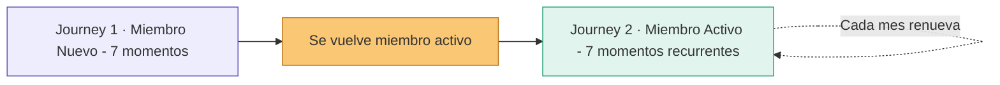
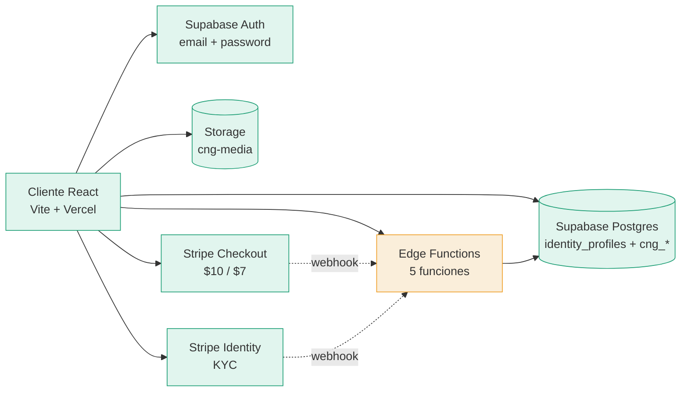
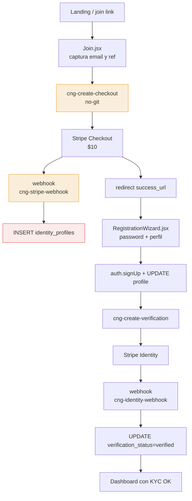
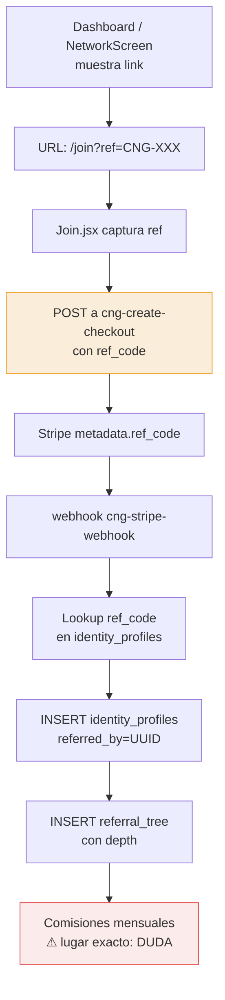
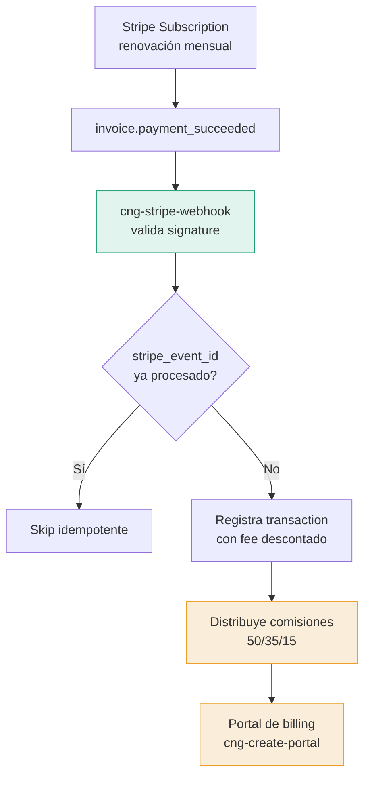
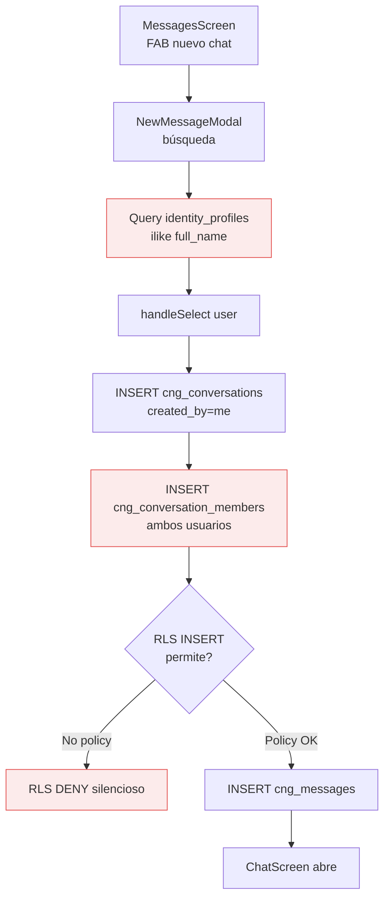
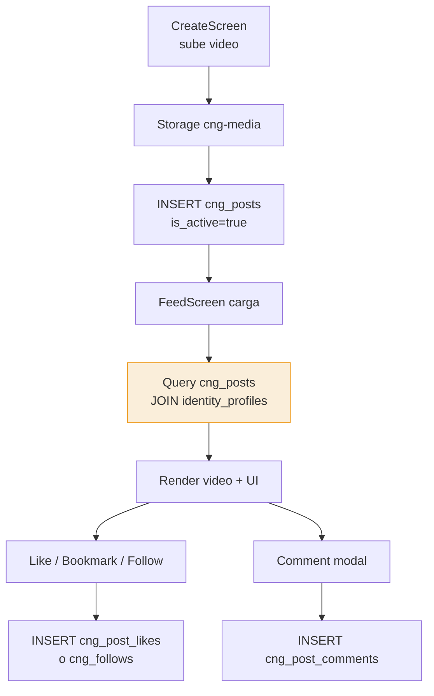
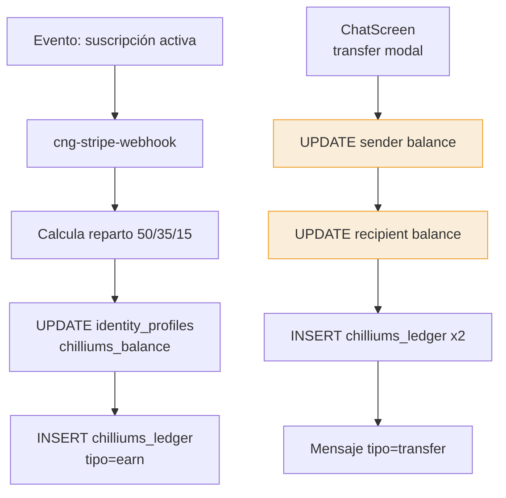

# CNG+ System Architecture

**Versión:** 1.0  
**Fecha:** 18 de abril de 2026  
**Autor:** Oscar Jovani (único desarrollador)  
**Estado del documento:** Vivo — actualizar al tocar arquitectura

---

## 1. Overview

CNG+ es una red social verificada con membresía de pago. Los miembros pagan $10 el primer mes (que cubre verificación de identidad vía Stripe Identity) y luego $7/mes recurrente. La app incluye feed tipo TikTok, mensajería directa, stories, y un programa de referidos de 2 niveles. La economía interna corre sobre **Chilliums** (programa de lealtad, no dinero). El sistema está construido sobre Supabase + Stripe, desplegado en Vercel.

👉 **Empieza por la Sección 3 (Journey Map) para entender el sistema en el idioma del usuario. Las demás secciones son referencia técnica de apoyo.**

---

## 2. Stack Técnico

| Capa | Tecnología | Versión |
|---|---|---|
| UI | React | 19.2.4 |
| Build | Vite | 8.0.1 |
| Routing | react-router-dom | 7.14.0 |
| Backend | Supabase (Postgres + Auth + Storage + Edge Functions) | project ref `jahnlhzbjcbmjnuzxsvj` |
| SDK cliente | @supabase/supabase-js | 2.101.1 |
| Pagos | Stripe Checkout (hosted) | — |
| KYC | Stripe Identity (flow `vf_1TI1VhClWFP3vllVQjUBTF7X`) | — |
| Hosting | Vercel | — |
| Storage bucket | `cng-media` | Supabase Storage |

> Nota: No hay SDK de Stripe en frontend — todo el flujo de pago es vía redirect a páginas hospedadas de Stripe.

---

## 3. Mapas del Usuario (Journey Maps) — VISTA PRINCIPAL

CNG App tiene dos tipos de usuarios que viven journeys distintos: el miembro nuevo durante su onboarding (Sección 3.1), y el miembro activo que ya usa la app dia con dia (Sección 3.2). Ambos mapas están conectados — el final del primero es el inicio del segundo.

### 3.1 Journey del Miembro Nuevo (Onboarding)

Este es el mapa más importante del sistema. Arriba se muestra qué vive el usuario en cada momento, y abajo qué pieza del código está trabajando. Los colores indican el estado de salud de cada componente técnico. Si un usuario reporta un problema, localiza el momento en el mapa y verás inmediatamente qué revisar.

```mermaid
flowchart TD
    subgraph M1["Momento 1 · Descubrimiento"]
        U1["Vanessa le comparte link por WhatsApp"]
        S1["Sistema: solo un link, nada mas"]
    end

    subgraph M2["Momento 2 · Interes"]
        U2["Abre el link y ve que Vanessa lo invita"]
        S2["Join.jsx captura ref_code del URL"]
    end

    subgraph M3["Momento 3 · Registro"]
        U3["Llena sus datos y paga 10 USD"]
        S3["Supabase Auth + Stripe Checkout + cng-stripe-webhook"]
    end

    subgraph M4["Momento 4 · Verificacion"]
        U4["Sube INE y selfie"]
        S4["Stripe Identity + cng-identity-webhook"]
    end

    subgraph M5["Momento 5 · Primer uso"]
        U5["Entra al feed tipo TikTok"]
        S5["FeedScreen + cng_posts + cng_follows"]
    end

    subgraph M6["Momento 6 · Interaccion social"]
        U6["Le escribe mensaje a alguien"]
        S6["MessagesScreen · BUG falta policy INSERT"]
    end

    subgraph M7["Momento 7 · Recompensa"]
        U7["Invita amigo y gana Chilliums"]
        S7["referral_tree + chilliums_ledger"]
    end

    U1 --> S1 --> U2
    U2 --> S2 --> U3
    U3 --> S3 --> U4
    U4 --> S4 --> U5
    U5 --> S5 --> U6
    U6 --> S6 --> U7
    U7 --> S7

    style U1 fill:#EEEDFE,stroke:#534AB7
    style U2 fill:#EEEDFE,stroke:#534AB7
    style U3 fill:#EEEDFE,stroke:#534AB7
    style U4 fill:#EEEDFE,stroke:#534AB7
    style U5 fill:#E1F5EE,stroke:#1D9E75
    style U6 fill:#E1F5EE,stroke:#1D9E75
    style U7 fill:#E1F5EE,stroke:#1D9E75
    style S1 fill:#F1EFE8,stroke:#888780
    style S2 fill:#F1EFE8,stroke:#888780
    style S3 fill:#F1EFE8,stroke:#888780
    style S4 fill:#E1F5EE,stroke:#1D9E75
    style S5 fill:#F1EFE8,stroke:#888780
    style S6 fill:#FCEBEB,stroke:#E24B4A
    style S7 fill:#F1EFE8,stroke:#888780
```



### Leyenda de colores

- 🟣 Morado: usuario en onboarding (aún no es miembro activo)
- 🟢 Verde: usuario activo usando la app
- ⚪ Gris: sistema funcionando normal
- 🟢 Verde en sistema: recién auditado y confirmado OK
- 🟡 Amarillo: riesgo conocido pendiente de arreglar
- 🔴 Rojo: bug confirmado que afecta al usuario

### Momentos que necesitan atención

| Momento | Qué vive el usuario | Bug técnico | Referencia |
|---------|---------------------|-------------|------------|
| Momento 1 · 2 · 3 | Pierde atribución de referido si cierra pestaña en Stripe | `ref_code` solo persistido en URL, sin localStorage/cookie | Ver Sección 5.2 |
| Momento 3 | Paga pero el webhook crashea al reintentar el mismo email | `cng-stripe-webhook` usa `.insert()` sin upsert en `identity_profiles` | Ver Sección 5.1 |
| Momento 3 | Un agente del Matrix no puede suscribirse a CNG+ | `auth.signUp()` rechaza el email si ya existe en `auth.users` | Ver Sección 5.1 |
| Momento 6 | No encuentra a un usuario que sabe que existe | Búsqueda solo filtra por `full_name` (no email, username, first_name) | Ver Sección 5.4 |
| Momento 6 | Usuarios con `full_name` NULL no aparecen en resultados | Caso Mónica — registros incompletos | Ver Sección 5.4 |
| Momento 6 | No puede enviar mensaje nuevo a alguien sin conversación previa | Falta policy INSERT en `cng_conversation_members` → RLS deny silencioso | Ver Sección 5.4 |
| Momento 6 | El clic "no hace nada" cuando la creación falla | `handleSelect` hace `console.error` sin toast al usuario | Ver Sección 5.4 |
| Momento 7 | Race condition potencial al transferir Chilliums | Transferencia hace UPDATE directo en cliente, no atómica | Ver Sección 5.6 |

<!-- DUDA: el bug "botón Ir a mi cuenta no navega" no está localizado con certeza aún. Podría afectar Momento 3 (después de pagar) o Momento 5 (primer uso). -->

### 3.2 Journey del Miembro Activo (Uso diario)

Una vez que el miembro pasó el onboarding, su relación con la app se vuelve diaria. Este mapa cubre los 7 momentos clave de uso recurrente, incluyendo la renovación mensual de membresía.

```mermaid
flowchart TD
    subgraph M8["Momento 8 · Regreso a la app"]
        U8["Abre la app y hace login"]
        S8["Supabase Auth + carga de identity_profile"]
    end
    subgraph M9["Momento 9 · Consumo de contenido"]
        U9["Scrollea feed y ve videos"]
        S9["FeedScreen + cng_posts + cng_likes"]
    end
    subgraph M10["Momento 10 · Creación de contenido"]
        U10["Sube una foto o video propio"]
        S10["CreatePostScreen + Supabase Storage + cng_posts"]
    end
    subgraph M11["Momento 11 · Mantiene relaciones"]
        U11["Chatea con amigos y sigue gente nueva"]
        S11["MessagesScreen + cng_conversations + cng_follows"]
    end
    subgraph M12["Momento 12 · Gasta Chilliums"]
        U12["Canjea Chilliums por beneficios"]
        S12["WalletScreen + chilliums_ledger + transactions"]
    end
    subgraph M13["Momento 13 · Acumula comisiones"]
        U13["Ve su red crecer y gana dinero"]
        S13["NetworkScreen + referral_tree + chilliums_ledger"]
    end
    subgraph M14["Momento 14 · Renovación mensual"]
        U14["Se le cobran 7 USD automáticamente"]
        S14["Stripe Subscriptions + cng-stripe-webhook"]
    end
    U8 --> S8 --> U9
    U9 --> S9 --> U10
    U10 --> S10 --> U11
    U11 --> S11 --> U12
    U12 --> S12 --> U13
    U13 --> S13 --> U14
    U14 --> S14
    style U8 fill:#E1F5EE,stroke:#1D9E75
    style U9 fill:#E1F5EE,stroke:#1D9E75
    style U10 fill:#E1F5EE,stroke:#1D9E75
    style U11 fill:#E1F5EE,stroke:#1D9E75
    style U12 fill:#E1F5EE,stroke:#1D9E75
    style U13 fill:#E1F5EE,stroke:#1D9E75
    style U14 fill:#E1F5EE,stroke:#1D9E75
    style S8 fill:#F1EFE8,stroke:#888780
    style S9 fill:#F1EFE8,stroke:#888780
    style S10 fill:#F1EFE8,stroke:#888780
    style S11 fill:#FCEBEB,stroke:#E24B4A
    style S12 fill:#F1EFE8,stroke:#888780
    style S13 fill:#F1EFE8,stroke:#888780
    style S14 fill:#FAEEDA,stroke:#EF9F27
```



<!-- DUDA: el diagrama menciona "CreatePostScreen" y "WalletScreen" — en el código git actual solo existe CreateScreen.jsx (no "Post" en el nombre); WalletScreen NO existe como archivo — la UI para gastar/canjear Chilliums no está implementada todavía. La funcionalidad de transferir Chilliums está embebida dentro de ChatScreen.jsx. Los labels del diagrama se preservan como los diste porque reflejan la intención de producto, pero la tabla siguiente marca las brechas reales contra el código. -->

### Momentos que necesitan atención

| Momento | Qué vive el usuario | Bug o riesgo | Referencia |
|---------|---------------------|--------------|------------|
| Momento 9 | Ve el feed pero los perfiles que aparecen no coinciden con los que encuentra en búsqueda | Feed filtra por `cng_posts.is_active=true` y hace JOIN con `identity_profiles`; búsqueda lee `identity_profiles` directo — mismatch entre ambos caminos | Ver Sección 5.5 |
| Momento 10 | Sube un post y el archivo se guarda pero el post no aparece | Upload a `cng-media` y INSERT a `cng_posts` no son transaccionales — si falla el INSERT queda archivo huérfano en bucket | [CreateScreen.jsx:128-145](src/pages/app/CreateScreen.jsx:128) |
| Momento 10 | Sube video muy largo y pasa la validación | Límite de 3 min validado solo en cliente; sin enforcement server-side ni constraint en DB | [CreateScreen.jsx:103](src/pages/app/CreateScreen.jsx:103) |
| Momento 11 | No puede iniciar chat nuevo ni encontrar gente por su email | Hereda TODOS los bugs del Momento 6: falta policy INSERT en `cng_conversation_members`, búsqueda solo por `full_name`, `handleSelect` sin toast de error | Ver Sección 5.4 |
| Momento 12 | No tiene dónde canjear Chilliums | ❌ No existe `WalletScreen` en el código — feature no implementada | <!-- pendiente de diseño/implementación --> |
| Momento 12 | Transfiere Chilliums a un amigo por chat y se producen dobles débitos | Transferencia hace UPDATE directo en cliente — no atómica, expuesta a race condition | Ver Sección 5.6 |
| Momento 13 | Ve su red pero no le llegan las comisiones mensuales de $3.50 / $2.00 | Lógica de comisiones recurrentes no está en código git — posiblemente en pg_cron o fuera del repo | Ver Sección 5.2 (DUDA pendiente) |
| Momento 14 | Le cobran el mes y su membresía se renueva | ✅ Idempotencia PRESENTE: webhook chequea `stripe_event_id` en `transactions.metadata` antes de procesar | [cng-stripe-webhook/index.ts:359-400](supabase/functions/cng-stripe-webhook/index.ts:359) |
| Momento 14 | Stripe reenvía el mismo evento en ventana apretada | ⚠️ Riesgo residual: la idempotencia chequea con `.eq().maybeSingle()` antes del `.insert()` — sin lock transaccional, dos invocaciones concurrentes podrían ambas pasar el check | [cng-stripe-webhook/index.ts:364-400](supabase/functions/cng-stripe-webhook/index.ts:364) |

### Conexión entre journeys



---

## 4. Mapa Técnico del Sistema (Vista de Pájaro)

> Esta sección es complementaria al Journey Map. Úsala cuando necesites entender la topología técnica de las piezas.



⚠️ **Edge Functions amarillo** porque 2 de las 5 funciones invocadas (`cng-create-checkout`, `cng-create-portal`) **no están versionadas en git** — viven solo en Supabase.

---

## 5. Flujos Críticos

### 5.1 Registro de miembro nuevo

**Descripción:** El usuario llega a `/join`, ingresa email, es redirigido a Stripe Checkout ($10), vuelve, completa el wizard de registro, pasa por Stripe Identity (KYC), y queda activo. Todo sin intervención humana.



**Componentes:**
- [src/pages/Join.jsx](src/pages/Join.jsx) (landing + captura ref)
- [src/components/RegistrationWizard.jsx](src/components/RegistrationWizard.jsx) (post-pago)
- [src/context/AuthContext.jsx](src/context/AuthContext.jsx) (signUp)
- [supabase/functions/cng-stripe-webhook/index.ts](supabase/functions/cng-stripe-webhook/index.ts) (crea fila)
- [supabase/functions/cng-create-verification/index.ts](supabase/functions/cng-create-verification/index.ts) (dispara KYC)
- [supabase/functions/cng-identity-webhook/index.ts](supabase/functions/cng-identity-webhook/index.ts) (marca verificado)
- ⚠️ `cng-create-checkout` — invocada desde [Join.jsx:231](src/pages/Join.jsx:231) pero **no existe en git**

**Tablas:** `identity_profiles`, `referral_tree` (si hay ref), `auth.users` (vía Supabase Auth)

**Edge Functions:** las 5 listadas arriba

**Riesgos conocidos:**
- ❌ Webhook `cng-stripe-webhook` usa `.insert()` sin upsert en `identity_profiles` → duplicate email = crash, usuario queda atascado tras pagar
- ⚠️ `ref_code` solo persistido en `success_url` → si el usuario cierra pestaña en Stripe, pierde la atribución
- ⚠️ Un agente del Matrix (con fila en `auth.users`) no puede ser miembro CNG+ — `auth.signUp()` rechaza el email existente

---

### 5.2 Sistema de referidos (2 niveles)

**Descripción:** Cada miembro tiene un `ref_code` corto (`CNG-XXXXXX`). Al registrar a alguien con ese code, el referido queda vinculado en `referral_tree` con su depth. Comisiones: nivel 1 = $3.50/mes + 35%; nivel 2 = $2.00/mes + 15%.



**Componentes:**
- [src/pages/Dashboard.jsx:12-13](src/pages/Dashboard.jsx:12) — construye link `/join?ref=CNG-XXX`
- [src/pages/app/NetworkScreen.jsx:17-18](src/pages/app/NetworkScreen.jsx:17) — mismo link en app
- [src/pages/Join.jsx:122-124](src/pages/Join.jsx:122) — captura `?ref=`
- [supabase/functions/cng-stripe-webhook/index.ts:226-233](supabase/functions/cng-stripe-webhook/index.ts:226) — resuelve code → UUID
- [supabase/functions/cng-stripe-webhook/index.ts:284](supabase/functions/cng-stripe-webhook/index.ts:284) — inserta en `referral_tree`

**Tablas:** `identity_profiles.ref_code`, `identity_profiles.referred_by`, `identity_profiles.referral_depth`, `referral_tree`, `chilliums_ledger` (comisiones)

**Edge Functions:** `cng-stripe-webhook`, `cng-create-checkout` (⚠️ no-git)

<!-- DUDA: ¿dónde se calculan y pagan las comisiones mensuales recurrentes de $3.50 / $2.00? No vi una edge function que corra mensualmente. Podría vivir en un cron de Supabase (pg_cron) o en lógica del webhook de renovación. Necesita auditoría adicional. -->

**Riesgos conocidos:**
- ⚠️ Persistencia solo por URL — edge cases pierden comisiones
- ⚠️ Lógica de comisiones recurrentes **no localizada en código git** — puede estar en pg_cron o fuera del repo

---

### 5.3 Suscripción recurrente

**Descripción:** Tras el primer mes de $10, Stripe facturará $7/mes automáticamente. El webhook recibe eventos `invoice.payment_succeeded` para mantener el estado activo, y `customer.subscription.deleted` para cancelaciones.



**Componentes:**
- [src/pages/Dashboard.jsx:18](src/pages/Dashboard.jsx:18) — invoca portal (`cng-create-portal`)
- [src/pages/app/ProfileScreen.jsx:47](src/pages/app/ProfileScreen.jsx:47) — mismo portal
- [supabase/functions/cng-stripe-webhook/index.ts](supabase/functions/cng-stripe-webhook/index.ts) — maneja eventos

**Tablas:** `transactions` (recién agregada para idempotencia), `chilliums_ledger`, `identity_profiles`

**Edge Functions:** `cng-stripe-webhook`, `cng-create-portal` (⚠️ no-git)

**Fixes recientes (git log):**
- ✅ `e44fc0a` — idempotency via `stripe_event_id` en `transactions.metadata`
- ✅ `0a06a1d` — descuenta Stripe fee del monto distribuible
- ✅ `8011d5c` — usa `source_user_id` en `chilliums_ledger`

**Riesgos conocidos:**
- ⚠️ Reparto 50/35/15 — confirmar cobertura con la [auditoria-chilliums-2026-04-16/](auditoria-chilliums-2026-04-16/)
- ⚠️ `cng-create-portal` no versionada en git

---

### 5.4 Mensajería social

**Descripción:** Usuario busca a otro miembro, abre chat nuevo, se crean filas en `cng_conversations` + `cng_conversation_members`, y se envían mensajes vía `cng_messages`. Soporta texto, media, polls, reactions, starred, blocked users, reports.



**Componentes:**
- [src/pages/app/MessagesScreen.jsx:40-45](src/pages/app/MessagesScreen.jsx:40) — búsqueda
- [src/pages/app/MessagesScreen.jsx:56-111](src/pages/app/MessagesScreen.jsx:56) — handleSelect (crea conversación)
- [src/pages/app/ChatScreen.jsx](src/pages/app/ChatScreen.jsx) — interfaz de chat (1600+ líneas, maneja todo)
- [src/pages/app/StoriesComponents.jsx:24-77](src/pages/app/StoriesComponents.jsx:24) — reply a story crea conversación también

**Tablas:** `cng_conversations`, `cng_conversation_members`, `cng_messages`, `cng_message_reactions`, `cng_starred_messages`, `cng_blocked_users`, `cng_reports`, `cng_polls`, `cng_poll_votes`

**RLS (de [src/sql/social-tables.sql](src/sql/social-tables.sql)):**
- `cng_conversations` INSERT: `created_by = auth.uid()` ✅
- `cng_conversation_members` INSERT: **❌ NO EXISTE POLICY** → deny por default
- `cng_messages` INSERT: `sender_id = auth.uid()` + membership check ✅

**Bugs críticos:**
- ❌ **Falta policy INSERT en `cng_conversation_members`** → enviar mensaje a usuario sin conversación previa falla siempre
- ❌ `handleSelect` hace `console.error` sin toast → usuario ve silencio
- ⚠️ Búsqueda usa solo `full_name` con `.ilike()` → no encuentra por email, first_name, ni username
- ⚠️ Sin dedup de conversaciones → abrir chat dos veces crea dos conversaciones

---

### 5.5 Feed social

**Descripción:** Usuarios crean posts (video + caption), aparecen en feed vertical tipo TikTok con likes, bookmarks, comments, follows.



**Componentes:**
- [src/pages/app/CreateScreen.jsx:129-145](src/pages/app/CreateScreen.jsx:129) — crea post (upload + INSERT)
- [src/pages/app/FeedScreen.jsx:436-569](src/pages/app/FeedScreen.jsx:436) — feed infinito con likes/bookmarks/follows
- [src/pages/app/ExploreScreen.jsx:89](src/pages/app/ExploreScreen.jsx:89) — grid explorer de posts
- [src/pages/app/ProfileScreen.jsx:26-29](src/pages/app/ProfileScreen.jsx:26) — posts del usuario en su perfil

**Tablas:** `cng_posts`, `cng_post_likes`, `cng_post_comments`, `cng_post_bookmarks`, `cng_follows`, `identity_profiles` (autor JOIN)

**Storage:** bucket `cng-media` (videos + imágenes)

**Riesgos conocidos:**
- ⚠️ Feed filtra por `cng_posts.is_active=true` pero la búsqueda de usuarios no cruza este filtro → usuarios aparecen en feed pero no en búsqueda (inconsistencia reportada)
- <!-- DUDA: ¿hay algoritmo de ranking del feed o solo orden cronológico? No visto en código. -->

---

### 5.6 Chilliums (economía interna)

**Descripción:** Chilliums son un programa de lealtad (NO dinero). Valor interno 1:1 USD para contabilidad, pero NUNCA se muestra así al usuario. Se ganan por referidos y suscripciones; se gastan o transfieren vía chat.



**Componentes:**
- [src/pages/app/ChatScreen.jsx:1235-1290](src/pages/app/ChatScreen.jsx:1235) — transferencia de Chilliums entre usuarios
- [src/pages/Network.jsx:91](src/pages/Network.jsx:91) — lectura del ledger
- [src/pages/app/NetworkScreen.jsx:91](src/pages/app/NetworkScreen.jsx:91) — idem en app
- [supabase/functions/cng-stripe-webhook/index.ts](supabase/functions/cng-stripe-webhook/index.ts) — distribución por suscripción

**Tablas:** `identity_profiles.chilliums_balance`, `chilliums_ledger`

**Riesgos conocidos:**
- ⚠️ Transferencia en ChatScreen hace UPDATE directo a `chilliums_balance` en cliente → race condition si dos transferencias concurrentes. Debería ser vía RPC transaccional o Edge Function.
- ⚠️ Commit reciente `cbdc91e` — "detect silent RLS failure on recipient balance update" — indica que ya hubo un bug de RLS en esta ruta
- 📄 Ver [auditoria-chilliums-2026-04-16/](auditoria-chilliums-2026-04-16/) para auditoría detallada

---

## 6. Tablas de Base de Datos

> Lista derivada de `.from()` en código. El schema real vive en Supabase dashboard; este repo no tiene `supabase/migrations/`.

### Core / Identity
| Tabla | Propósito |
|---|---|
| `identity_profiles` | Perfil principal del miembro CNG+ (FK a `auth.users.id`) |
| `cng_members_compat` | Vista de compatibilidad (migración desde `cng_members`) |
| `referral_tree` | Árbol de referidos con depth (nivel 1, 2) |
| `chilliums_ledger` | Libro mayor de transacciones de Chilliums |
| `transactions` | Transacciones Stripe con `stripe_event_id` para idempotencia |

### Feed / Social
| Tabla | Propósito |
|---|---|
| `cng_posts` | Videos/imágenes del feed |
| `cng_post_likes` | Likes a posts |
| `cng_post_comments` | Comentarios en posts |
| `cng_post_bookmarks` | Posts guardados |
| `cng_follows` | Relación follower → following |

### Mensajería
| Tabla | Propósito |
|---|---|
| `cng_conversations` | Hilo de conversación (directo o grupo) |
| `cng_conversation_members` | Miembros en cada conversación |
| `cng_messages` | Mensajes individuales |
| `cng_message_reactions` | Reacciones a mensajes (emoji) |
| `cng_starred_messages` | Mensajes marcados |
| `cng_blocked_users` | Bloqueos entre usuarios |
| `cng_reports` | Reportes de moderación |

### Stories / Polls
| Tabla | Propósito |
|---|---|
| `cng_stories` | Stories efímeras (24h) |
| `cng_story_views` | Vistas por story |
| `cng_story_reactions` | Reacciones a stories |
| `cng_story_replies` | Respuestas privadas a stories |
| `cng_polls` | Encuestas dentro de chat |
| `cng_poll_votes` | Votos a encuestas |

### Storage
| Bucket | Propósito |
|---|---|
| `cng-media` | Videos, imágenes, avatares |

<!-- DUDA: existe tabla `cng_notifications` referenciada en src/sql/social-tables.sql:436 pero no se usa desde el frontend. ¿Es un stub futuro? -->

---

## 7. Edge Functions

| Función | Estado | Propósito |
|---|---|---|
| `cng-create-checkout` | ❌ No en git | Crea Stripe Checkout Session para $10 inicial |
| `cng-create-portal` | ❌ No en git | Crea Stripe Billing Portal session para gestionar suscripción |
| `cng-create-verification` | ✅ En git | Crea Stripe Identity VerificationSession |
| `cng-stripe-webhook` | ✅ En git | Procesa eventos de Stripe Checkout + Subscription |
| `cng-identity-webhook` | ✅ En git | Procesa eventos de Stripe Identity (KYC verificado) |

**Configuración crítica:** `supabase/config.toml` desactiva `verify_jwt` para `cng-stripe-webhook` (Stripe no envía Authorization header).

---

## 8. Rutas del Frontend

Desde [src/App.jsx](src/App.jsx):

| Ruta | Componente | Notas |
|---|---|---|
| `/` | `Landing` | Pública |
| `/login` | `Login` | Pública |
| `/join` | `Join` | Pública (captura `?ref=`) |
| `/dashboard` | redirect → `/app/feed` | Protegida |
| `/app` | `AppShell` (con outlets `null`) | Protegida — AppShell renderiza screens por pathname |
| `/app/feed` | FeedScreen (vía AppShell) | — |
| `/app/explore` | ExploreScreen | — |
| `/app/create` | CreateScreen | — |
| `/app/messages` | MessagesScreen | — |
| `/app/profile` | ProfileScreen | — |
| `/app/network` | NetworkScreen | — |
| `/app/chat/:conversationId` | ChatScreen | — |
| `/app/travel`, `/app/candystakes`, `/app/realestate`, `/app/nutrition`, `/app/store-local`, `/app/store` | Placeholders / features en desarrollo | — |
| `/network` | `Network` (legacy, fuera de `/app`) | Protegida — ⚠️ posible duplicado con `/app/network` |

<!-- DUDA: ¿por qué existe /network y /app/network? Uno es legacy — debería consolidarse. -->

---

## 9. Bugs Conocidos y Deuda Técnica

| # | Bug | Severidad | Ubicación | Estado |
|---|---|---|---|---|
| 1 | Búsqueda solo usa `full_name` (no email, username, first_name) | ❌ Crítico UX | [MessagesScreen.jsx:40-45](src/pages/app/MessagesScreen.jsx:40) | Pendiente |
| 2 | Registros con `full_name` NULL no aparecen en búsqueda (caso Mónica) | ⚠️ Bloqueante puntual | Schema issue | Pendiente |
| 3 | Falta policy INSERT en `cng_conversation_members` → enviar mensaje nuevo falla | ❌ Bug crítico | [social-tables.sql:395-407](src/sql/social-tables.sql:395) | Pendiente |
| 4 | `handleSelect` hace `console.error` sin toast al usuario | ⚠️ UX silenciosa | [MessagesScreen.jsx:106-107](src/pages/app/MessagesScreen.jsx:106) | Pendiente |
| 5 | Webhook `cng-stripe-webhook` usa `.insert()` sin upsert → crash en retry | ⚠️ Riesgo de pagos perdidos | [cng-stripe-webhook/index.ts:238-255](supabase/functions/cng-stripe-webhook/index.ts:238) | Idempotencia de eventos ya agregada (e44fc0a); upsert de perfil aún no |
| 6 | Botón "Ir a mi cuenta" no navega en algunos casos | ⚠️ UX | <!-- DUDA: localizar exactamente --> | Pendiente |
| 7 | `ref_code` solo persistido en URL (sin localStorage) → pérdidas de comisión | ⚠️ Riesgo | [Join.jsx:237-238](src/pages/Join.jsx:237) | Pendiente |
| 8 | Dual role (agente Matrix que quiere ser miembro CNG+) no soportado | ❌ Bloqueante para casos especiales | [RegistrationWizard.jsx:387-404](src/components/RegistrationWizard.jsx:387) | Pendiente — requiere rediseño |
| 9 | Transferencia de Chilliums en cliente (UPDATE directo) → race condition | ⚠️ Riesgo de doble gasto | [ChatScreen.jsx:1235-1290](src/pages/app/ChatScreen.jsx:1235) | Pendiente — mover a RPC/Edge |
| 10 | 2 Edge Functions (`cng-create-checkout`, `cng-create-portal`) no versionadas en git | ⚠️ Riesgo operacional | — | Pendiente — `supabase functions download` |
| 11 | RLS de `identity_profiles` no está en git (vive solo en dashboard) | ⚠️ Riesgo operacional | — | Pendiente — traer a git |
| 12 | No hay `supabase/migrations/` → schema no versionado | ⚠️ Riesgo | — | Pendiente — `supabase db pull` |

---

## 10. Checklist de Salud del Sistema

| Componente | Estado | Última revisión | Notas |
|---|---|---|---|
| Stripe Identity (flow) | ✅ OK | 17 abr 2026 | SSN desactivado |
| Supabase email confirm | ✅ OK | 17 abr 2026 | Desactivado para signup automático |
| Webhook `cng-identity-webhook` | ✅ OK | 17 abr 2026 | HMAC verificado, actualiza por email |
| Webhook `cng-stripe-webhook` (JWT) | ✅ OK | 18 abr 2026 | `verify_jwt=false` vía config.toml |
| Webhook `cng-stripe-webhook` (idempotencia de eventos) | ✅ OK | ~17 abr 2026 | Commit e44fc0a |
| Webhook `cng-stripe-webhook` (idempotencia de perfil) | ⚠️ Riesgo | — | `.insert()` crashea en retry |
| Búsqueda de usuarios | ❌ Bug | 18 abr 2026 | Solo `full_name`, sin filtros consistentes |
| Flujo enviar mensaje nuevo | ❌ Bug | 18 abr 2026 | Falta policy INSERT en `conversation_members` |
| Feed social | ⚠️ Warning | 18 abr 2026 | Mismatch de filtros con búsqueda |
| Chilliums (transferencias) | ⚠️ Warning | 17 abr 2026 | UPDATE cliente, RLS silenciosa detectada |
| Chilliums (reparto 50/35/15) | ✅ OK | 17 abr 2026 | Commits 0a06a1d, 8011d5c corrigen reparto |
| Referral link persistence | ⚠️ Warning | 18 abr 2026 | Solo URL, sin localStorage backup |
| Dual-role user (agente + miembro) | ❌ Gap | 18 abr 2026 | `auth.signUp` rechaza email existente |
| Schema versionado | ❌ Gap | 19 abr 2026 | No hay `supabase/migrations/` en repo |
| Edge Functions versionadas | ⚠️ Warning | 19 abr 2026 | 2 de 5 no están en git |
| RLS de `identity_profiles` versionada | ❌ Gap | 19 abr 2026 | Solo en dashboard |
| Emails transaccionales | ❓ Desconocido | — | <!-- DUDA: ¿qué emails existen? ¿bienvenida, confirmación de pago, KYC OK? --> |

---

## 11. Decisiones de Arquitectura Importantes (ADRs)

### ADR-01 — Uso de `identity_profiles` (no `cng_members`)
`cng_members` fue la tabla original. Se migró a `identity_profiles` para alinear el nombre con Stripe Identity y permitir un modelo de perfil más rico. `cng_members_compat` es una vista de compatibilidad que aún se consulta desde código legacy. **Estado:** migración en progreso; nueva lógica debe escribir en `identity_profiles` directamente.

### ADR-02 — Stripe Identity sin SSN
La opción de colectar SSN en Stripe Identity está desactivada. Motivo: reducir fricción en onboarding y limitar el alcance regulatorio del KYC. La verificación se queda en documento de identidad + selfie. **Estado:** confirmado, funcional al 17 abr 2026.

### ADR-03 — Email confirm desactivado en Supabase Auth
Supabase Auth permite configurar si un email debe confirmarse antes de autenticar. Está desactivado para que un usuario pueda completar el flujo completo (pago → wizard → KYC) sin clicks extra en su email. La verificación del humano se delega a Stripe Identity, que es más robusta que un click en link. **Estado:** confirmado, funcional.

### ADR-04 — Modelo $10 primer mes + $7 recurrente
El primer mes cuesta $10 porque cubre el costo de Stripe Identity (~$1.50) más margen; los meses siguientes son $7 puro. Esto hace el primer pago "rentable" para cubrir fraude de identidad, y el precio recurrente competitivo. **Estado:** vigente.

### ADR-05 — Referidos a 2 niveles (no multinivel)
Se eligió 2 niveles de referidos (directo + indirecto) en lugar de MLM profundo. Motivo: mantener la estructura legal lejos de esquemas piramidales y que el reparto (50/35/15) sume 100% sin requerir cálculos complejos. **Estado:** vigente.

### ADR-06 — Hosted Stripe Checkout (sin SDK en frontend)
En lugar de usar `@stripe/stripe-js` en el cliente, se redirige a la página hospedada de Stripe. Motivo: menor superficie de código PCI-sensible, cero configuración de elementos de pago, y un solo punto de auditoría. **Estado:** vigente.

### ADR-07 — `verify_jwt = false` para webhook de Stripe
Stripe no envía `Authorization` header en sus webhooks, así que Supabase Edge Functions los rechazaba con 401. Se configuró `supabase/config.toml` para desactivar verify_jwt solo en `cng-stripe-webhook`. La seguridad se delega a la validación de la firma `stripe-signature` dentro del handler. **Estado:** desplegado 18 abr 2026.

---

## Apéndice A — Comandos útiles

```bash
# Deploy de Edge Function
npx supabase functions deploy <name> --project-ref jahnlhzbjcbmjnuzxsvj

# Traer schema del proyecto remoto a git (pendiente de ejecutar)
npx supabase db pull

# Traer Edge Functions faltantes (pendiente)
npx supabase functions download cng-create-checkout --project-ref jahnlhzbjcbmjnuzxsvj
npx supabase functions download cng-create-portal --project-ref jahnlhzbjcbmjnuzxsvj
```

---

## Apéndice B — Preguntas abiertas (DUDA)

1. ¿Dónde se calculan las comisiones recurrentes de nivel 1/2 ($3.50 / $2.00 mensuales)? ¿pg_cron, webhook, u otro?
2. ¿Qué emails transaccionales existen? (bienvenida, pago, KYC completado)
3. ¿Por qué coexisten `/network` y `/app/network`?
4. ¿`cng_notifications` (definido en social-tables.sql:436) está en uso o es stub?
5. ¿Existe algoritmo de ranking del feed o solo orden cronológico?
6. Caso "Mónica": ¿por qué su `full_name` es NULL? ¿es un signup que no completó wizard?
7. El botón "Ir a mi cuenta" que no navega — ¿dónde vive exactamente?

---

## Última modificación

**18 de abril de 2026** — Sección 3 expandida a dos Journey Maps: 3.1 Miembro Nuevo (onboarding) y 3.2 Miembro Activo (uso diario, 7 momentos recurrentes incl. renovación mensual). Agregado diagrama de conexión entre ambos journeys. Auditado código para identificar bugs/riesgos de los momentos 8–14 contra el código real.

**18 de abril de 2026** — Añadido Journey Map como vista principal (Sección 3). Renumeradas secciones técnicas subsiguientes (antigua 3 → 4, 4 → 5, etc.). Agregado pointer en Sección 1 para guiar al lector hacia el Journey Map primero.
